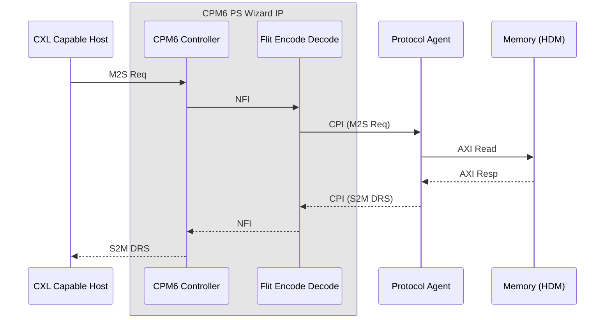
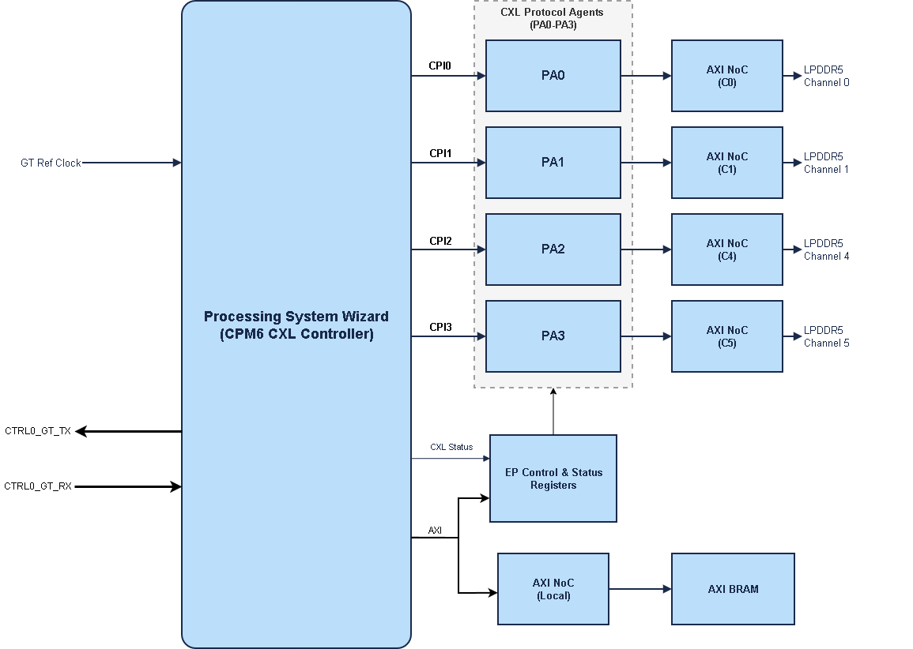

# Versal_CPM6_CXL_EP_Design
Please refer [PG463](https://account.amd.com/content/dam/account/en/member/cpm6-simulation/pg463-versal-cpm6-pcie-cxl_WtMkX.pdf) and [PG464](https://account.amd.com/content/dam/account/en/member/cpm6-simulation/pg464-cxl-transaction-ip_WtMkX.pdf) for detailed understanding of the Versal CPM6 CXL capabilities and some of the features and acronyms being discussed here.
This CED already applies the AR000040791 required for CXL EP Designs out of the 2026.1.1 Vivado release.

### Introduction

| Item | Summary |
|---|---|
| **Primary Purpose** | Demonstrates CXL Type-3 Endpoint capability of the Versal CPM6 hard IP, with CXL transaction layer and protocol agent for interfacing to memory in FPGA fabric. |
| **Configurations** | x8 or x4 link configuration with DDR/LPDDR5-backed memory backend, selectable on either CPM6 controller |
| **Example Type** | IP Example Design (CED) |
| **Target Audience** | Verification/FPGA engineers validating the CPM6 CXL datapath |
| **Devices Supported** | Versal devices with CPM6 hard IP (`vsvc3340` package family) — `xc2vp3602-vsvc3340-3HP-e-S` |
| **Tools Required** | Vivado 2026.1 (validated with build v2026.1.1), VCS/Verdi X-2025.06 with UVM 1.1, Avery PLI/apci-xactor 2025.3_1, CPM6 Secure IP package |
| **Simulators Validated** | VCS (waveform viewing via Verdi or DVE) |
| **Boards Validated** | N/A — no board is registered; this CED is part-only but the constraints applied work for VPK360 board|
| **Pre-Built Images** | Not available |
| **Key Features Shown** | CXL Type-3 system level design connecting CPM6 hard IP to target memory (DDR/LPDDR) via soft logic in FPGA fabric. cxl.io is routed via AXI-Bridge mode to Block RAM. Accompanying firmware elf to support CXL registers (component space and device status registers per specification requirement) |
| **Not Intended For** | Production deployment, performance benchmarking |
| **Time to First Success** | ~60-75 minutes (compile + optimize + simulate, order of magnitude) — not independently measured for this CED; based on the same VCS/UVM/Avery tool stack as comparable CPM6 CEDs |

---

### Overview

This example design demonstrates the CXL Type-3 Endpoint capability of the Versal CPM6 hard IP. It supports selectable link width and CXL mode (68B or 256B HBR flit mode) connected to LPDDR5-backed DDR variant — chosen via the CED GUI alongside the CPM6 controller.

By working through this example design, you will learn how to:
- Configure the CPM6 CXL Type-3 Endpoint lane rate (`32.0`/`64.0_GT/s`) and link width (`X4`/`X8`)
- Selection of 32.0 GT/s default to CXL2.0 68B flit mode and selection of 64 GT/s defaults to CXL3 256B HBR flit mode.
- x8 Gen5 defaults to NFI2, x4 Gen5 defaults to NFI1 while x8 Gen6 defaults to NFI3 and x4 Gen6 to NFI2 mode
- Drive CXL Type-3 traffic against the CPM6 hard IP through a UVM testbench, and observe the responses from the PL logic which also includes a DDR responder for simulation needs.
- Build and run the simulation using VCS, with optional Verdi/DVE waveform viewing

#### Included Features

- **CXL Type-3** — M2S transactions targetted to LPDDR5-backed apertures and responses on S2M interface.
- **Selectable CXL configuration** — CXL2 68B flit or CXL3 256B flit; design automatically switches to use the correct mode based on link negotiation. For example, a CXL3 x8 Gen6 design when connected to a host with CXL2 capability only, switches to 68B flit encode/decode automatically.


### Features

- CPM6 hard IP, selected controller, configured as a **CXL Type-3** endpoint.
- User-selectable CXL Protocol Mode (`68B` / `256B` Flit Mode) and link width (`X4`/`X8`) via the CED GUI.
- VCS/UVM + Avery PCIe VIP simulation environment with a smoke test and a set of DMA/DMA-flavored regression tests per variant.
- CED GUI driving a single parameterized build flow that assembles the correct sub-design, regenerates link parameters, and stages simulation files automatically.

### Design Architecture

At a high level, the design provides a single CXL Type-3 endpoint (either CPM6 controller) advetizing a total of 16GB HDM to host. Inbound M2S requests are striped across 4 CPI interfaces. Each CPI interface connects to independent protocol agents each with a dedicated 4G memory bank. 


#### Cxl.mem M2S Request Path

1. Host sends supported CXL Type-3 M2S request opcodes to device.
2. The CXL raw flit is made available from CPM6 hard IP to Flit Encode-Decode engine (included as part of Vivado CPM6 PS Wizard IP).
3. The CPI interface carries this request which is converted to AXI transaction by protocol agent.
4. The AXI interface is connected to memory via NoC.

#### Cxl.mem S2M Path

1. The AXI response from memory is converted to response on CPI channel by protocol agent.
2. The Flit encode engine creates the CXL flit with appropriate packing per specification.
3. This flit is then sent upstream to host via CPM6 CXL controller.


### Block Diagram



### Design Components

| Block design cell | IP | Role |
|---|---|---|
| `ps_wizard_0` | Processing System Wizard (CIPS) | Hosts the CPM6 hard-IP configuration (`CPM6_CONFIG`) for the selected controller (CXL Type-3 endpoint) plus PMC/PS configuration. The unselected controller is left `Disabled`/`None` in this CED. |
| `axi_noc2_0` | AXI NoC | Routes the `M_AXI` master interfaces from CXL Protocol Agent in fabric to the DDR memory controller. |
| `ddrmc5_responder_0` | DDR memory controller/PHY responder |
| `axi_bram_ctrl_0` | AXI BRAM Controller  | 512-bit, single-port AXI-to-BRAM bridge behind each `CPM_AXI_PLn` interface (for the cxl.io AXI Bridge interface). |
| `emb_mem_gen_0` | Embedded Memory Generator | Backing block-RAM storage for each `axi_bram_ctrl` instance. |
| `proc_sys_reset_0` | Processor System Reset | Synchronizes resets for the design's clock domains. |
| `cpa` (Encrypted RTL currently) | Custom PL logic | Consumes the CPI interface and converts to AXI. |

### Device Firmware
The device side firmware (elf files available under `fw` directory) executes on RPU (R5 core) on Processing Subsystem. This firmware is responsible for the following-
1. Managing CXL component space registers
2. Managing the CXL Device status registers (including the basic required commands via the primary mailbox)
3. CXL CDAT structure as required by specification via DOE mailbox capability in PCIe configuration space 
4. Programming the host assigned HDM address to fabric based protocol agent for address remapping i.e. HDM address to device private memory address.
The prebuilt elf provided follow the naming convention `zephyr_cX_cxlY.elf` where X indicates controller (`0` or `1`) and Y indicates CXL protocol mode (`2` for 68B and `3` for 256B mode). Use appropriate elf for designs.

| ELF Name | Controller | CXL Protocol Mode | Design Configuration |
|---|---|---|---|
| zephyr_c1_cxl2.elf | `1` | `68B` | x8 Gen5 or x4 Gen5 |
| zephyr_c1_cxl3.elf | `1` | `256B` | x8 Gen6 or x4 Gen6 | 
| zephyr_c0_cxl2.elf | `0` | `68B` | x8 Gen5 or x4 Gen5 |
| zephyr_c0_cxl3.elf | `0` | `256B` | x8 Gen6 or x4 Gen6 |

This CED provides a pre-built elf to be used for hardware testing. The source code for device firmware will be released as part of next update.

### Build Instructions

#### Project Generation Steps

1. In Vivado, click **Open Example Project**, then **Next** on the launch dialog.
2. In **Select Project Template**, search for and select **"Versal CPM6 CXL Type-3 Endpoint Design"**, then click **Next**.
3. Choose the project name and location.
4. On the **CPM6 CXL Type-3 Endpoint Configuration** page, choose:
   - **Controller selection** (`CTRL_CONFIG`): `Controller_0` or `Controller_1`.
   - **CXL Protocol Mode** (`CXL_PROTOCOL`): `68B_Flit` or `256B_Flit` mode.
   - **Link Width** (`CXL_WIDTH`): `4` or `8` (This with CXL protocol mode derives the NFI interface width).
5. Review the summary page and click **Finish**.

#### What Happens on Generation

`run.tcl`/`init.tcl` maps the GUI selections to one of four sub-designs:

| `CTRL_CONFIG` | `Width` | `CXL Protocol` | NFI Mode |
|---|---|---|---|
| `Controller_1` | `8` | `256B` | 3 |
| `Controller_1` | `4` | `256B` | 2 |
| `Controller_1` | `8` | `68B` | 2 |
| `Controller_1` | `4` | `68B` | 1 |
| `Controller_0` | `8` | `256B` | 3 |
| `Controller_0` | `4` | `256B` | 2 |
| `Controller_0` | `8` | `68B` | 2 |
| `Controller_0` | `4` | `68B` | 1 |


The generation flow then:

1. Sources the matching sub-design's `design_1_bd.tcl` to build the block design and import its `src/` RTL.
2. Adds `constrs/` to the constraints fileset.
3. Copies the shared `sim/` testbench tree into the project directory and overlays the selected variant's `sim/verif` DUT-instantiation on top of it.
4. Configures the `sim_1` fileset for VCS (`generate_scripts_only`), targeting the variant's top module.

#### Expected Outputs

- A Vivado project containing the generated block design, imported RTL, and constraints.
- A `sim/` directory in the generated project, staged for VCS/UVM simulation (no bitstream/hardware build target is exercised by this CED's intended flow).

### Performance Considerations

- Performance depends on multiple factors; a few examples are the latency of the device (inlcuding the memory access latency), CXL credits advertized by the device, the slot on the host system, link bandwidth etc. CED advertizes 128 M2S Request and M2S data credits. Increase in number of these credits comes at a cost of increase in buffering and subsequent timing challenges.
- Standard tools can be used to do a performance benchmark. Notably `memtester` is used for memory integrity and `Memory Latency Checker (MLC)` for latency and bandwidth measurements.

### Validation Flow

This CED provides a **simulation and board level** validation flow.

#### What's in `sim/`

```
sim/
  avery_vcs.f, cpm6_sip.f, uvma_agents.f, vcs_lib_map.setup   <- generic filelists
  lib/                                                        <- date.so, socket_dpi.so
  uvma_agents/                                                <- 8 generic UVM agents
  tb/                                                          <- tb_top.sv, binds, env/, generic test/
  verif/
    dut_inst.sv           <- DUT wrapper instantiation (CTRL1 default, CTRL0 via +define+CXL_BRDG_CTRL0)
    pkg.proj_test_pkg.sv  <- includes verif/test/*.sv
    setup_env_cfg.sv      <- env agent PASSIVE/ACTIVE overrides
    test/cxl_ep_brdg_sanity.sv
  run.sh                                                        <- convenience wrapper for run.tcl
```

**Known limitation - `lib/date.so` / `lib/socket_dpi.so` are not linked in.**
`standalone/Makefile` never passes `-sv_lib`/`-sv_root` to `vcs`, so DPI
calls that need them (`date()`, the `test_ide_tlps_spdm` DOE emulator
socket) aren't backed. Not hit by the default `cxl_ep_brdg_sanity` test;
expect a runtime failure if you run a test that does exercise them, until
that wiring is added to the `optimize` target.

Two concrete sub-paths exist for simulation - standalone and self-contained,
with no external regression-harness dependency:

#### 1. Full-fidelity (Avery VIP + UVM) - `sim/standalone/`

1. Download and unzip the CPM6 Secure IP package (provided separately) from https://account.amd.com/en/member/cpm6-simulation.html

2. Environment (every new shell - none of this persists). Make sure `vcs`
   (matching the VCS build Vivado's own clibs were compiled against - see
   `compxlib.vcs_compiled_library_dir` in `build_project.tcl`) and the Avery
   VIP tools are already reachable on your `$PATH`/`$LD_LIBRARY_PATH`, then
   set the following environment variables (tcsh or bash shell):
   - `CDOUTIL_PATH` -- optional; `dut_config.sv` falls back to `$PATH` if unset
     ```
     tcsh: setenv CDOUTIL_PATH <path to your cdoutil install>
     bash: export CDOUTIL_PATH=<path to your cdoutil install>
     ```
   - `CPM6_SECUREIP` -- directory where the CPM6 Secure IP package was extracted (must contain `2026.1.1/data/secureip/cpm6/{cpm6_001.svp,cpm6_002.svp}` and `2026.1.1/data/verilog/src/unisims/CPM6.v` - the real, non-stub secure-IP netlist; Vivado's own bundled `CPM6.v` is a stub that `$finish`s at time 0)
     ```
     tcsh: setenv CPM6_SECUREIP <path to extracted cpm6 secureip>
     bash: export CPM6_SECUREIP=<path to extracted cpm6 secureip>
     ```
   - `AVERY_PLI` -- Avery PLI binary location
     ```
     tcsh: setenv AVERY_PLI <path to avery pli install>
     bash: export AVERY_PLI=<path to avery pli install>
     ```
   - `SNPSLMD_LICENSE_FILE` -- your VCS license server list
     ```
     tcsh: setenv SNPSLMD_LICENSE_FILE <your VCS license server list>
     bash: export SNPSLMD_LICENSE_FILE=<your VCS license server list>
     ```
   - `VIVADO_CLIBS` -- Vivado's own precompiled simlib dir matching the VCS build above; `build_project.tcl` fails fast with a clear error if unset
     ```
     tcsh: setenv VIVADO_CLIBS <path to your precompiled vcs clibs>
     bash: export VIVADO_CLIBS=<path to your precompiled vcs clibs>
     ```
   - `SIM_QUICK_MEM_INIT` -- required for tests with real CXL.mem traffic (`cxl_ep_brdg_sanity` does). Read at Vivado BD-generation time, so must be set BEFORE `build_project.tcl` runs, not just before simulate. Without it, `axi_memory_init_N` defaults to a full 4GB init window instead of 1KB, and the sim appears to hang (advances in simulated time but never reaches `$finish`/RESULT) rather than failing with a clear error
     ```
     tcsh: setenv SIM_QUICK_MEM_INIT 1
     bash: export SIM_QUICK_MEM_INIT=1
     ```

3. Build + run - safe to run from a scratch/build directory outside this
   checkout; `sim/standalone/Makefile` resolves all paths relative to its own
   location, and Vivado/VCS build outputs use disjoint top-level names so
   nothing collides:
```bash
vivado -mode batch -source <path-to-this-CED-checkout>/sim/standalone/build_project.tcl \
  -tclargs <workdir> Controller_1 CXL_3_1

cd <workdir>
export VIVADO_CLIBS=<path-to-this-site's-precompiled-vcs-clibs>  # same value as above

# build_project.tcl copies this design's whole sim/ tree into <workdir>/sim
# first, so every make invocation below runs against that copy - not the
# original checkout - and never reads it live during compile/elaborate/simulate.

# One-shot (compile + optimize + simulate in a single command):
make -f <workdir>/sim/standalone/Makefile cos PROJ_DIR=<workdir> TEST=cxl_ep_brdg_sanity

# ...or step-by-step:
make -f <workdir>/sim/standalone/Makefile compile  PROJ_DIR=<workdir> TEST=cxl_ep_brdg_sanity
make -f <workdir>/sim/standalone/Makefile optimize PROJ_DIR=<workdir> TEST=cxl_ep_brdg_sanity   # (`elaborate`/`o` are aliases)
make -f <workdir>/sim/standalone/Makefile simulate PROJ_DIR=<workdir> TEST=cxl_ep_brdg_sanity
```
`PROJ_DIR` must match the `<workdir>` passed to `build_project.tcl` - these
`make` targets compile/elaborate/simulate the DUT scripts already generated
there, they don't rebuild the Vivado project.

**Simulated CXL link speed (`SPEED`) - deterministic, never randomized.**
`cxl_ep_brdg_sanity` forces a fixed link speed instead of the base
testbench's usual randomized Gen3-Gen6. Defaults to Gen6 (matching
`CXL_3_1`). For a `CXL_2_0`/Gen5 build, pass `SPEED=5`:
```bash
vivado -mode batch -source .../build_project.tcl -tclargs <workdir> Controller_1 CXL_2_0
cd <workdir>
make -f <workdir>/sim/standalone/Makefile cos PROJ_DIR=<workdir> TEST=cxl_ep_brdg_sanity SPEED=5
```
Nothing enforces `CXL_PROTOCOL` (build-time) and `SPEED` (sim-time)
agreeing - a mismatch still runs and prints `RESULT = PASS`, but tests a
meaningless configuration.

#### 2. Lightweight, no Avery VIP - `sim/light_tb/`

```bash
export VIVADO_CLIBS=<path-to-this-site's-precompiled-vcs-clibs>  # same as path 1 above
cd sim/light_tb
vivado -mode batch -source build_project_light.tcl -tclargs ./proj Controller_1 CXL_3_1
```
Then, in Vivado: Project Manager -> Settings -> Simulation -> set Target
simulator = VCS (or Questa) + Compiled Library Location -> check "Generate
Simulation scripts only" -> Flow Navigator -> Run Simulation. Then:
```bash
cd proj/design_1.sim/sim_1/behav/vcs
./compile.sh && ./elaborate.sh && ./simulate.sh
```
No Avery VIP, no `uvma_agents`, no external framework Makefile - just
Vivado + a simulator license + `$CPM6_SECUREIP`. **Scope is limited**: this
proves elaboration, PS-VIP reset sequencing, and `ctrl_reg_ep`'s AXI-Lite
CSR map - it does **not** generate CXL.mem traffic or train the link.

Both standalone sub-paths share an open item: the LPDDR5/DDR5 memory path
(see `sim/verif/dut_inst.sv` OPEN ITEM 3) has no BRAM-substituted sim variant yet.

#### 3. Via LSF (`bsub`), as one self-contained batch job

Wraps build+compile+optimize+simulate into a single script for `bsub`.
Works from any login shell (tcsh/csh included) since `bsub` execs the
script directly and the script carries its own `#!/bin/bash` shebang.

Write a self-contained script (adjust the Vivado path, `$CPM6_SECUREIP`,
and `WORKDIR` for your site - see path 1 above for what each placeholder
means):

```bash
#!/bin/bash
set -o pipefail

WORKDIR=<your-scratch-or-ref-dir>/sim1
STATUS_FILE=$WORKDIR/STATUS
CKPT_STANDALONE=<path-to-this-CED-checkout>/sim/standalone
mkdir -p $WORKDIR
echo "RUNNING:vivado" > $STATUS_FILE

source <path-to-your-Vivado-install>/settings64.sh
export VIVADO_CLIBS=<path-to-precompiled-vcs-clibs-for-that-build>
export VIVADO_TEMPDIR=<your-scratch-or-ref-dir>/vivado_tmp
mkdir -p "$VIVADO_TEMPDIR"

# REQUIRED before build_project.tcl runs (see path 1 above):
export SIM_QUICK_MEM_INIT=1

vivado -mode batch -tempDir "$VIVADO_TEMPDIR" \
  -source $CKPT_STANDALONE/build_project.tcl -tclargs $WORKDIR Controller_1 CXL_3_1 \
  > $WORKDIR/vivado_build.log 2>&1
VIVADO_RC=$?
if [ $VIVADO_RC -ne 0 ]; then
  echo "FAILED:vivado:rc=$VIVADO_RC" > $STATUS_FILE
  exit 1
fi
if grep -qE "^ERROR:|^Fatal:" $WORKDIR/vivado_build.log; then
  echo "FAILED:vivado:ERROR_lines_in_log" > $STATUS_FILE
  exit 1
fi
# build_project.tcl copies this design's whole sim/ tree into $WORKDIR/sim -
# every make invocation below runs against that copy, not $CKPT_STANDALONE.
MAKEDIR=$WORKDIR/sim/standalone

echo "RUNNING:compile" > $STATUS_FILE
# Make sure vcs and the Avery VIP tools are already reachable on
# $PATH/$LD_LIBRARY_PATH before this point - however your site provides that.
export CPM6_SECUREIP=<path-to-your-own-cpm6-secureip-extraction>
export AVERY_PLI=<path-to-avery-pli-install>
export SNPSLMD_LICENSE_FILE=<your-site's-VCS-license-server-list>

cd $WORKDIR

make -f $MAKEDIR/Makefile compile PROJ_DIR=$WORKDIR > $WORKDIR/make_compile.log 2>&1
if [ $? -ne 0 ]; then echo "FAILED:compile:rc=$?" > $STATUS_FILE; exit 1; fi

echo "RUNNING:optimize" > $STATUS_FILE
make -f $MAKEDIR/Makefile optimize PROJ_DIR=$WORKDIR > $WORKDIR/make_optimize.log 2>&1
if [ $? -ne 0 ]; then echo "FAILED:optimize:rc=$?" > $STATUS_FILE; exit 1; fi

echo "RUNNING:simulate" > $STATUS_FILE
timeout -s TERM 14400 make -f $MAKEDIR/Makefile simulate PROJ_DIR=$WORKDIR > $WORKDIR/make_simulate.log 2>&1
SIM_RC=$?
if [ $SIM_RC -eq 124 ]; then
  echo "DONE:simulate_timeout_expected" > $STATUS_FILE; exit 0
elif [ $SIM_RC -ne 0 ]; then
  echo "FAILED:simulate:rc=$SIM_RC" > $STATUS_FILE; exit 1
fi

echo "DONE:success" > $STATUS_FILE
```
`chmod +x` it, then submit:
```bash
bsub -K -q long -R "rusage[mem=16000] select[os==lin && type==X86_64 && osver==ws8]" \
  /path/to/your_script.sh
```
- `-K` blocks and streams output back - drop it (or add `-o <logfile>`) to
  fire-and-forget and poll with `bjobs`/`bpeek` later.
- The `select[...]` clause pins a compatible OS/arch (some hosts here can't
  even exec the pinned VCS build's 32-bit binaries otherwise).

**Check the result - don't trust `STATUS_FILE`/exit code alone.** A
mid-simulation `$finish`/`Fatal:` from a BFM or protocol checker often
doesn't flip the shell's exit code. Always also grep the sim log
(`$WORKDIR/<test_name>.sim.log`) for `UVM_FATAL`/`UVM_ERROR` counts and for
a bare `Fatal:`/`$finish called from` with no `--- UVM Report Summary ---`
banner - that combination means the simulator was killed outside the UVM
reporting path.

#### 4. End-to-end: build → simulate → open the waveform in DVE or Verdi

Shown in **tcsh/csh** syntax (`setenv`); substitute `export VAR=value` if
you're in bash.

Generate a wave dump (opt-in - full-hierarchy dumps run into hundreds of MB
to multiple GB) by passing a runtime plusarg at `simulate`:
```bash
make -f $MAKEDIR/Makefile simulate PROJ_DIR=$WORKDIR TEST=cxl_ep_brdg_sanity PLUSARGS=+dump_vcd
```
Produces `<test_name>.vcd` in `$WORKDIR`. Multi-hundred-MB VCDs are normal
for a ~140us run here. Omit `PLUSARGS=+dump_vcd` for routine runs.

Open it in DVE (`vcs`/`dve` must already be reachable on your `$PATH`):
```tcsh
# VCS_HOME must point at a full VCS-MX install with the DVE GUI package
# (some sites split compile/sim-only vs. full/GUI installs) - if `dve`
# fails with "Unable to find valid DVE installation in $VCS_HOME/gui/dve",
# point this at your site's full/GUI-capable install instead:
setenv VCS_HOME <path-to-your-site's-VCS-install-that-includes-the-DVE/gui-package>

# Needed for DVE's VT_Visual feature; same value as compile/elaborate:
setenv SNPSLMD_LICENSE_FILE "<your-site's-VCS/DVE-license-server-list>"

cd $WORKDIR
$VCS_HOME/bin/dve -full64 -vcd <test_name>.vcd &
```

Or open it in Verdi instead (`verdi` must already be reachable on your
`$PATH`):
```tcsh
# Needed for Verdi's own license feature; same value as compile/elaborate:
setenv SNPSLMD_LICENSE_FILE "<your-site's-VCS/Verdi-license-server-list>"

cd $WORKDIR
verdi -vcd <test_name>.vcd &
```

Finding the signal you want: DUT hierarchy is under
`tb_top.dut_inst.design_1_i...` (e.g.
`tb_top.dut_inst.design_1_i.PA_0.cxl_mem_wrapper_0...` for a PA's CXL.mem
path). Two gotchas:
- **Zoom level matters for narrow pulses** - a single-cycle handshake can
  be sub-pixel wide at the default zoomed-out view; zoom in before trusting
  a signal that looks constant.
- **A port name can be aliased one level up/down the hierarchy** via a
  no-logic wire - check the same-named net one level up/down before
  concluding the RTL is broken.

##### Hardware Testing
1. Download the boot.pdi and pld.pdi to program the FPGA. Select R5_0 as target and download the appropriate elf and run it. Instructions for OSPI bin file be available in a future release of the CED.
2. Recommend starting the host system from a cold boot.
3. Boot up the system and see if the device is detected in `lspci` and `cxl list` for CXL HDM detection and HDM commit status.
4. Check `numactl -H` to see if the CXL attached memory is already setup as a NUMA node. 
5. If CXL attached memory is not setup as a NUMA node, check if DAX node exists under `/dev/`.
6. If DAX node exists then use daxctl utility to inline the memory. As an example, if dax0.0 exists then `daxctl online-memory dax0.0` would show the CXL device as a separate NUMA node. This applies when there is a single CXL card connected to the host system.
7. Use standard utilities (like `memtester` for memory sweep) for cxl traffic test.
