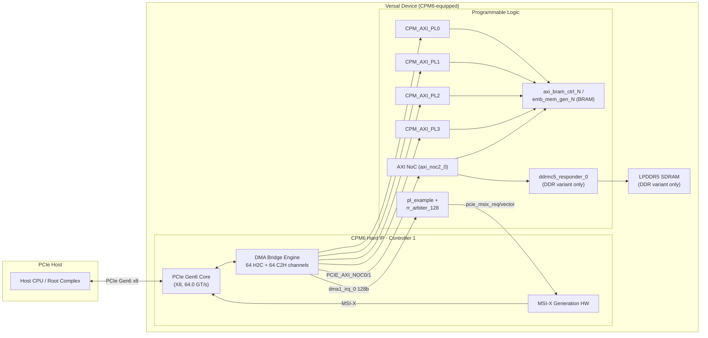
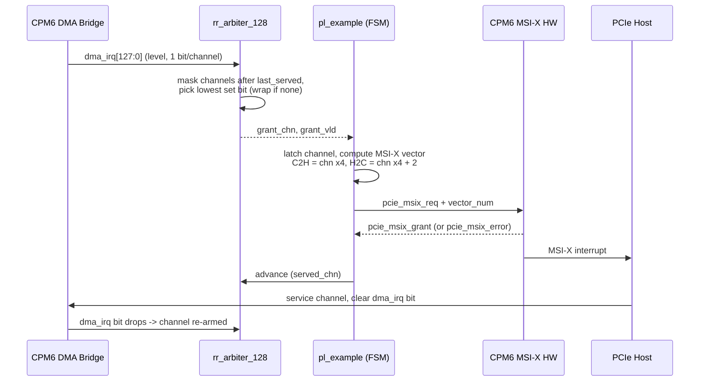
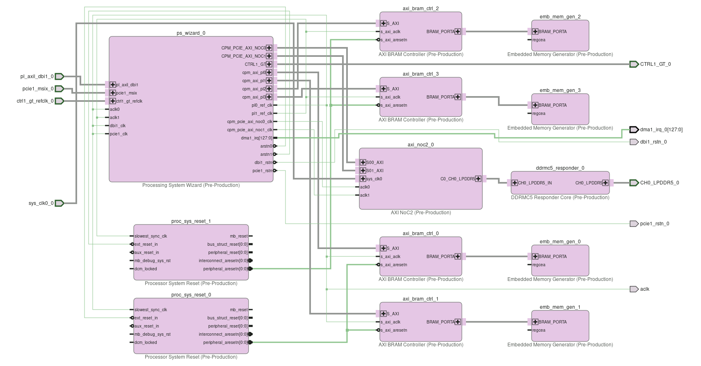
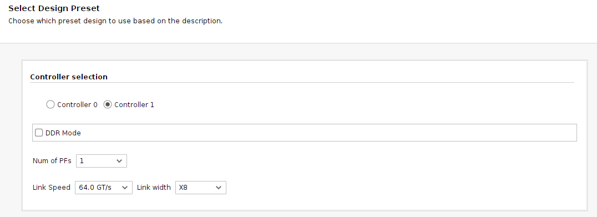
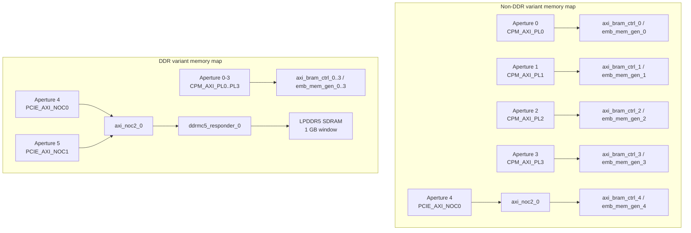

# Versal_CPM6_DMA_Design

## Introduction

| Item | Summary |
|---|---|
| **Primary Purpose** | Demonstrates DMA Bridge (H2C/C2H) capability of the Versal CPM6 hard IP, plus PL-side arbitration of DMA completion interrupts into MSI-X |
| **Configurations** | Non-DDR, all-BRAM memory backend (`dma`) or DDR/LPDDR5-backed memory backend (`dma_ddr`), both on CPM6 Controller 1 |
| **Example Type** | IP Example Design (CED) |
| **Target Audience** | Verification/FPGA engineers validating the CPM6 DMA Bridge datapath |
| **Devices Supported** | Versal devices with CPM6 hard IP (`vsvc3340` package family) — `xc2vp3602-vsvc3340-3HP-e-S`, `xc2vp3602-vsvc3340-2LHP-e-S` |
| **Tools Required** | Vivado 2026.1 (validated with build v2026.1.1), VCS/Verdi X-2025.06 with UVM 1.1, Avery PLI/apci-xactor 2025.3_1, CPM6 Secure IP package |
| **Simulators Validated** | VCS (waveform viewing via Verdi or DVE) |
| **Boards Validated** | N/A — no board is registered; this CED is part-only |
| **Pre-Built Images** | Not available |
| **Key Features Shown** | H2C/C2H DMA Bridge transfers, 128-channel (64 C2H + 64 H2C) DMA interrupt bus, MSI-X generation via round-robin arbitration (`pl_example`/`rr_arbiter_128`), selectable BRAM-only or LPDDR5-backed memory apertures, up to 8 PFs (DDR variant), PCIe Gen6 X8 link |
| **Not Intended For** | Production deployment, performance benchmarking, hardware bring-up (no board/JTAG/PCIe-host flow — see [Limitations](#limitations)) |
| **Time to First Success** | ~20–25 minutes (compile + optimize + simulate, order of magnitude) — not independently measured for this CED; based on the same VCS/UVM/Avery tool stack as comparable CPM6 CEDs |

---

## Overview

This example design demonstrates the DMA Bridge capability of the Versal CPM6 hard IP as a PCIe Gen6 Endpoint. It supports two selectable PL-side memory backends — an all-BRAM non-DDR variant (`dma`) and an LPDDR5-backed DDR variant (`dma_ddr`) — chosen via the CED GUI (`init.tcl`/`run.tcl`) alongside PCIe lane rate, link width, and physical function count, all on CPM6 Controller 1.

By working through this example design, you will learn how to:
- Configure CPM6 Controller 1's DMA Bridge lane rate (`16.0`/`32.0`/`64.0_GT/s`) and link width (`X1`/`X2`/`X4`/`X8`)
- Choose between an all-BRAM memory backend and an LPDDR5-backed memory backend for the CPM6 DMA/MMIO apertures
- Drive H2C/C2H DMA traffic against the CPM6 hard IP through a UVM testbench, and observe how DMA completion interrupts are arbitrated into MSI-X vectors by the `pl_example`/`rr_arbiter_128` PL logic
- Build and run the simulation using VCS, with optional Verdi/DVE waveform viewing

### Included Features

- **H2C DMA** — descriptor-based host-to-card transfers into BRAM or LPDDR5-backed apertures
- **C2H DMA** — descriptor-based card-to-host transfers from BRAM or LPDDR5-backed apertures
- **MSI-X interrupt generation** — round-robin arbitration of a 128-channel (64 C2H + 64 H2C) DMA interrupt bus into MSI-X vectors
- **Selectable memory backend** — BRAM-only (non-DDR variant) or single-channel LPDDR5 (DDR variant)
- **Multi-PF support** — up to 8 physical functions (DDR variant only; non-DDR variant is fixed at 1 PF)

## Features

- CPM6 hard IP, Controller 1, configured as a **DMA Bridge** PCIe Gen6 endpoint (`CPM6_CTRL1_MODE=DMA_BRIDGE`, `CPM6_CTRL1_PROTOCOL=PCIE_6_1`).
- User-selectable PCIe lane rate (`16.0_GT/s` / `32.0_GT/s` / `64.0_GT/s`) and link width (`X1`/`X2`/`X4`/`X8`) via the CED GUI.
- User-selectable physical function count: 1 PF (both variants) or 8 PFs (DDR variant only).
- 128-channel DMA interrupt bus (64 C2H + 64 H2C) arbitrated into MSI-X requests by an example PL round-robin arbiter.
- Two selectable memory backends: 5×/4× on-chip BRAM apertures (non-DDR), or BRAM + single-channel LPDDR5 (DDR variant).
- Four dedicated `CPM_AXI_PL0..PL3` PL-AXI interfaces plus one or two NoC-routed PCIe DMA apertures, enabled in both variants.
- VCS/UVM + Avery PCIe VIP simulation environment with a smoke test and a set of DMA/HDMA-flavored regression tests per variant.
- CED GUI (`init.tcl`) driving a single parameterized `run.tcl` build flow that assembles the correct sub-design, regenerates link parameters, and stages simulation files automatically.

## Design Architecture

At a high level, the design provides a single PCIe Gen6 endpoint (CPM6 Controller 1) whose DMA Bridge engine exposes multiple independent apertures to the host. Each aperture is independently routed in the PL/NoC fabric to either local Block RAM or (DDR variant only) external LPDDR5 memory. A single example PL logic block observes DMA completion status and drives MSI-X interrupts back to the host.



### Host-to-Card (H2C) Path

1. Host driver posts an H2C descriptor to the DMA Bridge engine's queue over the PCIe link.
2. CPM6's DMA Bridge engine fetches the descriptor and issues AXI write transactions toward the destination aperture (`CPM_AXI_PLn` or `PCIE_AXI_NOCn`).
3. The AXI transaction lands in BRAM (`axi_bram_ctrl`/`emb_mem_gen`) or, in the DDR variant, is routed through `axi_noc2_0` to `ddrmc5_responder_0` and the LPDDR5 array.
4. On completion, the DMA engine sets the corresponding bit in the 128-bit `dma1_irq_0` bus (H2C channels occupy bits `[127:64]`).

### Card-to-Host (C2H) Path

1. PL/backend memory content is read by the DMA Bridge engine via the same AXI aperture, driven by a C2H descriptor.
2. Data is packaged into PCIe TLPs and transferred to host memory.
3. On completion, the DMA engine sets the corresponding bit in `dma1_irq_0` (C2H channels occupy bits `[63:0]`).

### Interrupt / MSI-X Path



## Block Diagram



*The diagram shown is the DDR-enabled block design: `ps_wizard_0` hosts the CPM6 CTRL1 DMA-Bridge endpoint plus PS/PMC configuration; `axi_noc2_0` + `ddrmc5_responder_0` implement the LPDDR5 path; `axi_bram_ctrl_*` / `emb_mem_gen_*` implement the PL-AXI local-memory apertures; `proc_sys_reset_*` provide PS/PL reset synchronization. The non-DDR variant (`dma/`) omits `ddrmc5_responder_0` and adds a fifth BRAM pair in its place.*

## Design Components

| Block design cell | IP | Role |
|---|---|---|
| `ps_wizard_0` | Processing System Wizard (CIPS) | Hosts the CPM6 hard-IP configuration (`CPM6_CONFIG`) for Controller 1 (PCIe Gen6 DMA-Bridge endpoint) plus PMC/PS configuration. Controller 0 is left `Disabled`/`None` in this CED. |
| `axi_noc2_0` | AXI NoC | Routes the `PCIE_AXI_NOC0`/`PCIE_AXI_NOC1` master interfaces from CPM6 to either a BRAM destination (non-DDR variant) or the LPDDR5 memory controller (DDR variant). |
| `ddrmc5_responder_0` | LPDDR5 memory controller/PHY responder | **DDR variant only.** Single-channel, single-rank LPDDR5 SDRAM controller. |
| `axi_bram_ctrl_0..3` (both variants) / `axi_bram_ctrl_4` (non-DDR only) | AXI BRAM Controller (v4.1) | 512-bit, single-port AXI-to-BRAM bridge behind each `CPM_AXI_PLn` interface (and the NoC-routed 5th aperture in the non-DDR variant). |
| `emb_mem_gen_0..3` / `_4` | Embedded Memory Generator | Backing block-RAM storage for each `axi_bram_ctrl` instance. |
| `proc_sys_reset_0` / `proc_sys_reset_1` | Processor System Reset | Synchronizes PS/PL resets for the design's clock domains. |
| `pl_example` (RTL, `src/pl_example.sv`) | Custom PL logic | Consumes the 128-bit `dma1_irq_0` bus and drives MSI-X interrupt requests toward CPM6. |
| `rr_arbiter_128` (RTL, `src/rr_arbiter_128.sv`) | Custom PL logic | Masked-priority round-robin arbiter selecting one of 128 pending DMA-interrupt channels per grant. |
| `dma_top` / `dma_ddr_top` (RTL) | Top-level wrapper | Instantiates the block design plus (DDR variant) `pl_example`, exposing GT, refclk, LPDDR5, and `sys_clk0` ports at the top level. |

## CPM6 Configuration
CPM6 Controller 1 is configured as a PCIe Gen6 DMA Bridge endpoint in both variants; Controller 0 is unused.


| Property | Non-DDR variant (`dma`) | DDR variant (`dma_ddr`) |
|---|---|---|
| `CPM6_CTRL1_MODE` | `DMA_BRIDGE` | `DMA_BRIDGE` |
| `CPM6_CTRL1_PROTOCOL` | `PCIE_6_1` | `PCIE_6_1` |
| `CPM6_CTRL1_LANE_RATE` / `LINK_WIDTH` | user-selected, default `64.0_GT/s` / `X8` | user-selected, default `64.0_GT/s` / `X8` |
| `CPM6_CTRL1_NUM_PFS` | fixed at `1` | user-selected, `1` or `8` |
| `CPM6_CTRL1_NUM_DMA_APERTURES` | `5` | `7` |
| `CPM6_CTRL1_NUM_MMIO_APERTURES` | `5` | `7` |
| `CPM6_CTRL1_NUM_INBOUND_REGIONS` | `5` | `5` |
| PF0 BAR size (`PF0_BARn_SIZE`) | `256` KB per BAR (`BAR_1..BAR_5`) | `128` KB per BAR (`BAR_1..BAR_5`) |
| MSI-X | not configured at the `ps_wizard` level | `CPM6_CTRL1_PF0_MSIX_EN=1`, 256 vectors, table/PBA offsets `0x10000`/`0x14000`; `CPM6_CTRL1_PF0_MSI_EN=1` |
| `CPM6_AXI_PL0..PL3_IF` | all `1` (enabled) | all `1` (enabled) |
| PCIe reset | `PMC_MIO_39` | `PMC_MIO_39` |
| Controller 0 | not configured (`CPM6_CTRL0_MODE=None`, `CPM6_CTRL0_PROTOCOL=Disabled`) | same |

All values above are read directly from each variant's `design_1_bd.tcl` (`CONFIG.CPM6_CONFIG(...)` property list), not inferred.

## DMA Subsystem

CPM6's **DMA Bridge** mode implements a descriptor-ring-based H2C/C2H DMA engine (distinct from CPM6's alternative QDMA mode, which is not used in this CED). Each configured DMA aperture is an independent address window that the host can target; CPM6 internally routes it to one of the enabled PL-AXI/NoC destinations.

### DMA / MMIO Apertures

**Non-DDR variant** (`0x0500_0000_0000` PCIe DMA aperture space):

| Aperture | Base | Limit | Destination |
|---|---|---|---|
| 0 | `0x0500_0000_0000` | `0x0500_0001_FFFF` | `CPM_AXI_PL0` (default) |
| 1 | `0x0500_0002_0000` | `0x0500_0003_FFFF` | `CPM_AXI_PL1` |
| 2 | `0x0500_0004_0000` | `0x0500_0005_FFFF` | `CPM_AXI_PL2` |
| 3 | `0x0500_0006_0000` | `0x0500_0007_FFFF` | `CPM_AXI_PL3` |
| 4 | `0x0500_0008_0000` | `0x0500_0009_FFFF` | `PCIE_AXI_NOC0` → NoC → `axi_bram_ctrl_4` |

Each aperture is exposed to the host as a 256 KB PCIe BAR; the backing BRAM decodes only the first 64 KB (`0x1_0000`) of that window.

**DDR variant** adds two further apertures on top of the same four PL-AXI ones:

| Aperture | Base | Limit | Destination |
|---|---|---|---|
| 4 | `0x0500_2000_0000` | `0x0500_3FFF_FFFF` | `PCIE_AXI_NOC0` → NoC → LPDDR5 (`DDR_CH1`) |
| 5 | `0x0500_4000_0000` | `0x0500_5FFF_FFFF` | `PCIE_AXI_NOC1` → NoC → LPDDR5 (`DDR_CH1`) |

The NoC's `DDR_MC_PORTS/DDR_CH1` segment is `0x0500_2000_0000`, range `0x4000_0000` (1 GB) — both PCIe NoC master ports land in the same 1 GB DDR window. In this variant, each 128 KB BAR/aperture's backing BRAM (`axi_bram_ctrl_0..3`) decodes the full 128 KB (`0x2_0000`) of its aperture.

CPM6's own register space sits at the standard Versal location `0xFC00_0000` (16 MB); this and the rest of the CIPS/PMC/PS address map (ADMA, GIC, CRF/CRL/CRP, AES/SHA3, BBRAM, CoreSight, etc.) are the standard `ps_wizard`-generated Versal PS/PMC map and are not specific to this design.

### MSI-X / Interrupt Generation

`dma1_irq_0[127:0]` from the CPM6 DMA engine is split by `pl_example` into two 64-channel groups — C2H (bits `[63:0]`) and H2C (bits `[127:64]`) — and arbitrated by `rr_arbiter_128`:

- `rr_arbiter_128` performs round-robin selection over the 128 request bits: it masks the request vector to channels above the last-served index, isolates the lowest set bit, and wraps around to the lowest set bit of the full vector if nothing qualifies above the last-served index.
- `pl_example` maps the granted channel to an MSI-X vector: `vector = {c2h_chn,2'b00}` for C2H channels, `vector = {h2c_chn,2'b00} + 2` for H2C channels (4 vectors per channel, offset by 2 between C2H/H2C).
- A one-shot latch (`irq_sent_latched`) prevents re-requesting MSI-X for a channel that is still asserting `dma_irq` until the host has serviced it and the DMA engine drops the bit.
- A 2-state FSM (`SM_INT_IDLE`/`SM_INT_REQ`) drives `pcie_msix_req` when the arbiter grants an eligible channel, and returns to idle on `pcie_msix_grant` or `pcie_msix_error`.
- Only PF0 is driven (`pcie_msix_func_num`/`vfunc_active`/`vfunc_num` hardwired to 0) — no SR-IOV/virtual-function support in this example logic.
- An AXI-Lite debug interface (`m_pl_axil_*`) exists in `pl_example` but is currently commented out/unused.

## Memory Architecture



### PL-AXI Local Memory (both variants)

Four to five `axi_bram_ctrl` (v4.1, 512-bit, single-port) + `emb_mem_gen` pairs back the `CPM_AXI_PLn` interfaces (and, non-DDR only, the NoC-routed 5th aperture).

### LPDDR5 Memory (DDR variant only)

`ddrmc5_responder_0` / `axi_noc2_0` are configured for a single-channel, single-rank LPDDR5 SDRAM:

| Property | Value |
|---|---|
| Controller type | `LPDDR5_SDRAM` |
| Channels / MCs / ranks | 1 / 1 / 1 |
| Device type | Components |
| Density / device width | 4 GB density, x16 device width, 32-bit MC data width |
| Speed grade | `LPDDR5X-8533` |
| Bank architecture | `BG` (bank-group), address map `ROW_BANK_COLUMN` |
| System reference clock | Differential, `sys_clk0_0`, 319.795 MHz (`create_clock -period 3.127`) |

Top-level ports added for the DDR variant: `CH0_LPDDR5_0` (LPDDR5 PHY interface: `ca[6:0]`, `ck_c/t`, `cs[1:0]`, `dmi[3:0]`, `dq[31:0]`, `rdqs_c/t[3:0]`, `reset_n`, `wck_c/t[3:0]`), `sys_clk0_0` (DDR reference clock), `pcie1_msix_0` (MSI-X interface, routed to `pl_example`), `pcie1_rstn_0`, `aclk`. Pin placement/electrical constraints for the LPDDR5 PHY are in `constrs/noc_ddr5_phy_phy.xdc` (per-pin `IOSTANDARD` (`LVSTL05_10`), `ODT`/`CTLE_EQ`/`SLEW`/`PACKAGE_PIN` properties for a single LPDDR5 channel; no timing constraints are included there — DDR PHY timing is closed internally by the `ddrmc5_responder` IP).

## DDR Mode Operation

In the DDR variant (`dma_ddr/`, top module `dma_ddr_top`):

- Two of the DMA Bridge's apertures (4 and 5) are routed through both PCIe NoC master ports (`PCIE_AXI_NOC0`/`PCIE_AXI_NOC1`) into a single shared 1 GB LPDDR5 window (`axi_noc2_0/DDR_MC_PORTS/DDR_CH1`), giving the host two independent AXI paths into the same DDR address space.
- Up to 8 physical functions can be configured (`NUM_PFS` = `1` or `8`), and MSI-X is fully configured at the CPM6 level (256 vectors/PF0).
- `pl_example` and `rr_arbiter_128` are instantiated in the DDR variant's top-level wrapper (`hdma_ddr_top`/`dma_ddr_top`) to convert `dma1_irq_0` into MSI-X requests — this logic is **only present in the DDR variant's top-level RTL**, not in the non-DDR `dma_top`.
- BRAM apertures (`CPM_AXI_PL0..PL3`) are still present and decode their full 128 KB aperture window (vs. 64 KB of a 256 KB window in the non-DDR variant).
- Requires the `constrs/noc_ddr5_phy_phy.xdc` pin/electrical constraints, added automatically by `run.tcl` when `DDR_EN=true`.

## Non-DDR Mode Operation

In the non-DDR variant (`dma/`, top module `dma_top`):

- All five DMA apertures terminate in on-chip BRAM — four behind dedicated `CPM_AXI_PLn` interfaces and one routed through the NoC to a fifth BRAM pair, with no external memory controller in the design.
- Only 1 PF is supported (`NUM_PFS` fixed at `1`).
- MSI-X is not configured at the `ps_wizard`/CPM6 level in this variant, and the top-level RTL wrapper (`dma_top`) does not instantiate `pl_example`/`rr_arbiter_128` — only the raw `dma1_irq_0` bus and GT/refclk ports are exposed.
- Each 256 KB PCIe BAR aperture is backed by only 64 KB of addressable BRAM — the remainder of the BAR window is unmapped.
- Simplest variant to bring up in simulation: no DDR PHY constraints, no DDR controller timing/calibration behavior to model.

## Build Instructions

### Prerequisites

- Vivado 2026.1 (validated with build v2026.1.1), with the CPM6 IP available.
- VCS / Verdi — X-2025.06
- UVM Library — 1.1
- Avery PLI — 2025.3_1
- Avery apci-xactor (PCIe VIP) — 2025.3_1
- CPM6 Secure IP package (obtained separately from AMD: https://account.amd.com/en/member/cpm6-simulation.html)

### Project Generation Steps

1. In Vivado, click **Open Example Project**, then **Next** on the launch dialog.
2. In **Select Project Template**, search for and select **"Versal CPM6 DMA Design"**, then click **Next**.
3. Choose the project name and location.
4. Select one of the two supported parts (`xc2vp3602-vsvc3340-3HP-e-S` or `xc2vp3602-vsvc3340-2LHP-e-S`) — no board selection is offered for this CED.
5. On the **CPM6 DMA Configuration** page, choose:
   - **Controller selection** (`CTRL_CONFIG`): use `Controller_1` (see [Limitations](#limitations) regarding `Controller_0`).
   - **DDR Mode** (`DDR_EN`): enable for the LPDDR5-backed variant.
   - **Num of PFs** (`NUM_PFS`): `1` or `8` (DDR variant only allows `8`).
   - **Link Speed** (`CTRL_LANE_RATE`) and **Link Width** (`CTRL_LINK_WIDTH`).
6. Review the summary page and click **Finish**.

### What Happens on Generation

`run.tcl`/`init.tcl` map the GUI selections to one of four sub-designs:

| `CTRL_CONFIG` | `DDR_EN` | Sub-design dir | Top module |
|---|---|---|---|
| `Controller_1` | `false` | `dma/` | `dma_top` |
| `Controller_1` | `true` | `dma_ddr/` | `dma_ddr_top` |
| `Controller_0` | `false` | `dma_ctrl0/` | `design_1_wrapper` |
| `Controller_0` | `true` | `dma_ddr_ctrl0/` | `dma_ddr_top` |

> **Note:** Only the `Controller_1` sub-designs (`dma/`, `dma_ddr/`) exist in this repository. Selecting `Controller_0` in the GUI is currently exposed but will fail at the `import_files` step, since `dma_ctrl0/` and `dma_ddr_ctrl0/` are not present.

The generation flow then:

1. Sources the matching sub-design's `design_1_bd.tcl` to build the block design and import its `src/` RTL, along with the CED's top-level `src/`.
2. Regenerates `defines.sv` (`dma_link_pkg`/`hdma_link_pkg`) in the **project** directory with the selected `LINK_WIDTH`/`LANE_RATE`/`NUM_PFS`.
3. Adds `constrs/noc_ddr5_phy_phy.xdc` to the constraints fileset when `DDR_EN` is enabled.
4. Copies the shared `sim/` testbench tree into the project directory and overlays the selected variant's `sim/verif` DUT-instantiation on top of it.
5. Configures the `sim_1` fileset for VCS (`generate_scripts_only`), targeting the variant's top module.

### Expected Outputs

- A Vivado project containing the generated block design (`cpm6_dma`/`cpm6_hdma` equivalent), imported RTL, and constraints.
- A `sim/` directory in the generated project, staged for VCS/UVM simulation (no bitstream/hardware build target is exercised by this CED's intended flow).

## Performance Considerations

- **Link bandwidth**: default configuration is PCIe Gen6 x8 (`64.0_GT/s` × 8 lanes) — the theoretical maximum raw link bandwidth for this CED's default settings; lower lane rate/width options (down to Gen1 x1) are available via the CED GUI for constrained or bring-up scenarios.
- **Aperture window size caps single-transfer addressability**: non-DDR apertures decode only 64 KB behind each 256 KB BAR; DDR-variant BRAM apertures decode the full 128 KB behind each 128 KB BAR. Transfers must stay within the decoded window, not the full BAR size.
- **DDR bandwidth ceiling**: the DDR variant's LPDDR5 controller is `LPDDR5X-8533` speed grade, single-channel/single-rank, 32-bit MC data width — this bounds the achievable C2H/H2C throughput for DDR-routed apertures below the raw PCIe link rate for large transfers.
- **Shared DDR window across NoC ports**: both `PCIE_AXI_NOC0` and `PCIE_AXI_NOC1` apertures land in the *same* 1 GB LPDDR5 window in the DDR variant — concurrent transfers through both apertures contend for the same memory controller and rank.
- **Interrupt latency**: `rr_arbiter_128`'s round-robin policy guarantees fairness across the 128 DMA channels but does not prioritize by channel; a channel's MSI-X notification latency depends on how many other channels are simultaneously requesting.
- No formal hardware performance/throughput measurement flow is included in this CED (see [Validation Flow](#validation-flow)) — the above are structural bandwidth/latency bounds inferred from the configuration, not measured results.

## Validation Flow

This CED provides a **simulation-only** validation flow; there is no hardware test bench, board bring-up procedure, or PCIe-host driver flow included.

### Simulation Setup

1. Download and unzip the CPM6 Secure IP package (provided separately) from https://account.amd.com/en/member/cpm6-simulation.html
2. Set the following environment variables (tcsh or bash shell):
   - `AVERY_PLI` — Avery PLI binary location
     ```
     tcsh: setenv AVERY_PLI <path to avery pli install>
     bash: export AVERY_PLI=<path to avery pli install>
     ```
   - `AVERY_PCIE` — Avery PCIe source libraries
     ```
     tcsh: setenv AVERY_PCIE <path to avery apci xactor install>
     bash: export AVERY_PCIE=<path to avery apci xactor install>
     ```
   - `CPM6_SECUREIP` — directory where the CPM6 Secure IP package was extracted
     ```
     tcsh: setenv CPM6_SECUREIP <path to extracted cpm6 secureip>
     bash: export CPM6_SECUREIP=<path to extracted cpm6 secureip>
     ```
   - `VIVADO_CLIBS` — directory containing your precompiled VCS simulation libraries for the selected Vivado/VCS version
     ```
     tcsh: setenv VIVADO_CLIBS <path to compiled simlibs>
     bash: export VIVADO_CLIBS=<path to compiled simlibs>
     ```
   Verify:
   ```
   echo $VCS_HOME       # should show X-2025.06 path
   echo $AVERY_PLI      # should show avery_pli-2025.3_1 path
   echo $AVERY_PCIE     # should show apcievip-2025.3_1 path
   echo $CPM6_SECUREIP  # should show your extracted path
   echo $VIVADO_CLIBS   # should show your compiled simlib path
   ```
3. In the Vivado Tcl console (this CED is bundled with Vivado, so no `repoPaths` setup is needed) — substitute the desired `CTRL_CONFIG`/`DDR_EN`/`NUM_PFS`/`CTRL_LANE_RATE`/`CTRL_LINK_WIDTH` options (see [Build Instructions](#build-instructions)):
   ```
   create_project <project_name> <output_dir>/<project_name> -part <supported_part>
   create_bd_design "cpm6_dma" -mode batch
   instantiate_example_design -template xilinx.com:design:cpm6_dma:1.0 \
       -design cpm6_dma -options { CTRL_CONFIG.VALUE Controller_1 DDR_EN.VALUE false }
   ```
   Or, via the GUI: File → Project → New (or IP Catalog → Example Designs) and select "Versal CPM6 DMA Design".
4. This single step also generates the VCS simulation scripts and copies the `sim/` directory alongside the Vivado project — no separate `launch_simulation` step is needed.

**Expected outcome:**
The Vivado project is created, and `<project_name>/sim/` contains the `Makefile`, `test/`, `tb/`, and `verif/` directories ready to build.

### Simulation Setup
### Running Tests

From `<generated_project>/sim`:

| Command | Effect |
|---|---|
| `make cos` | Compile + optimize + simulate |
| `make cos DUMP=1` | Same, with waveform dump |
| `make s TEST=<name> SEED=<n>` | Re-simulate a specific test with a specific seed |
| `make smoke` | Run only the `hello_world` smoke test |
| `make distclean` | Wipe all compiled libs and start completely fresh |
| `make h` | Show all Makefile options |

### Available Tests

Real DMA-specific UVM tests are ported from `uvma-pcie-sim-framework/cpm6/common/test/hdma/` and compiled in via `sim/tb/test/hdma/` (shared across both variants). Representative tests:

| Variant | Flavor | Tests |
|---|---|---|
| Non-DDR (`dma/`) | `plaxi` | `test_s_hdma_plaxi_ctrlr1`, `test_M_bridge_plaxi_ctrlr1`, `test_M_bridge_plaxi_ctrlr1_4pf`, `test_M_bridge_plaxi_ctrlr1_4pf_axildecode` |
| DDR (`dma_ddr/`) | `ddr` | `test_s_hdma_ddr_ctrlr1`, `test_M_bridge_ddr_ctrlr1`, `test_M_bridge_ddr_ctrlr1_4pf`, `test_M_bridge_ddr_ctrlr1_bar24_1pf` |

A handful of generic framework tests (`test_init`, `test_enum`, `test_base`, `base_ep_test`, ...) are also compiled in via `sim/tb/test/test_pkg.svh`.

#### NON-DDR MODE

| Testcase Name | Function |
|---|---|
| `test_s_hdma_plaxi_ctrlr1` | Slave HDMA PL-AXI controller 1 verification |
| `test_M_bridge_plaxi_ctrlr1` | Master bridge PL-AXI controller 1 verification |
| `test_M_bridge_plaxi_ctrlr1_4pf` | Master bridge PL-AXI controller 1 with 4 physical functions (4PF) |
| `test_M_bridge_plaxi_ctrlr1_4pf_axildecode` | Master bridge PL-AXI controller 1, 4PF, with AXI-Lite address decode check |

#### DMA DDR MODE

| Testcase Name | Function |
|---|---|
| `test_s_hdma_ddr_ctrlr1` | Simple H2C HDMA transfer to PL-AXI0, 20 iterations, MSI interrupts |
| `test_M_bridge_ddr_ctrlr1` | Randomized write/read-check loop (100x) across BAR1–5, incl. DDR-routed BAR4/5, Ctrl1 PF0 |
| `test_M_bridge_ddr_ctrlr1_4pf` | Same BAR1–5 randomized DDR-bridge test, iterated across all discovered PFs |
| `test_M_bridge_ddr_ctrlr1_bar24_1pf` | Narrower variant: only BAR2 (PL-AXI0) + BAR4 (NOC-DDR0), iterated per PF |

**Verification status**: only the `hello_world` generic framework smoke test is independently verified per variant. The plaxi/ddr-flavored DMA tests above are ported/named by convention from a verified-passing regression (`cpm6/ctrl1ep_g6x8_hdma_1pf`) but have **not** been independently re-verified against this CED-generated project — treat them as a strong starting point, not confirmed sign-off.

## Limitations

- **`Controller_0` is not buildable.** It is exposed in the CED GUI, but its sub-designs (`dma_ctrl0/`, `dma_ddr_ctrl0/`) are not present in this repository; selecting it fails at `import_files` in `run.tcl`.
- **No hardware flow.** No board is registered for this CED (part-only); there is no JTAG/PCIe-host bring-up flow — this design targets PIPE simulation only.
- **AXI-Lite debug interface disabled.** `pl_example`'s `m_pl_axil_*` interface exists in the RTL but is commented out/unused.
- **DMA-specific tests not independently re-verified** against the CED-generated project (naming-convention-based mapping only) — see [Validation Flow](#validation-flow).
- **MSI-X arbitration example logic drives only PF0** — no SR-IOV/virtual-function support.
- **Non-DDR variant apertures under-decode their BAR window** (64 KB of BRAM behind a 256 KB BAR) — accesses beyond the decoded window are unmapped, not an error condition to be confused with a hardware fault.
- **`reference/bmd_test_example/` is not part of the active compile path** — it is retained purely as a structural reference for writing further DMA-specific verification content (see `reference/README.txt`).
- Design assumes a single LPDDR5 channel/rank in the DDR variant; no multi-channel or multi-rank DDR configuration is provided.

## References

- AMD Versal Adaptive SoC CPM6 documentation (DMA Bridge mode, MSI-X, NoC/DDR configuration) — see the Documentation tab of the CPM6/`ps_wizard` IP customization GUI in Vivado, or [docs.amd.com](https://docs.amd.com).
- `dma/sim/README.txt`, `dma_ddr/sim/README.txt` — customer-facing simulation setup for each variant.
- `reference/bmd_test_example/` — original BMD (Bus Master DMA) UVM verification package this design's `sim/` tree was bootstrapped from.

---

### Revision Notes

This README was generated by analyzing the CED source (`init.tcl`, `run.tcl`, `design.xml`, `xitem.json`, `dma/design_1_bd.tcl`, `dma_ddr/design_1_bd.tcl`, top-level RTL, constraints, and both variants' `sim/README.txt`) together with the corresponding generated Vivado projects (`project_dma_t2_26_1`, `project_hdma_ddr_T1`). All configuration values, address-map entries, and IP parameters quoted above were cross-checked directly against `CONFIG.CPM6_CONFIG(...)`/`CONFIG.DDRMC5_CONFIG(...)` property lists in the `design_1_bd.tcl` scripts and against the constraint files, not inferred from the block diagram alone. Two areas are explicitly **assumptions carried over from the CED's own documentation**, not independently re-derived by this analysis:

- The claim that the ported `plaxi`/`ddr`-flavored DMA tests correspond to a previously verified-passing regression (`cpm6/ctrl1ep_g6x8_hdma_1pf`) is taken from each variant's `sim/README.txt` and has not been independently re-run.
- Performance figures in [Performance Considerations](#performance-considerations) are structural bounds derived from IP configuration (link rate, DDR speed grade, aperture decode size), not measured benchmark results — no benchmarking methodology ships with this CED.
