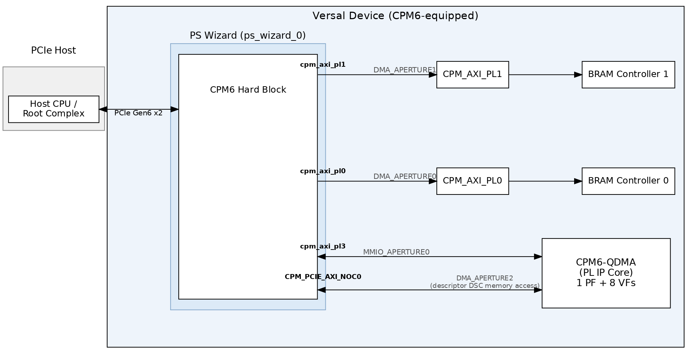
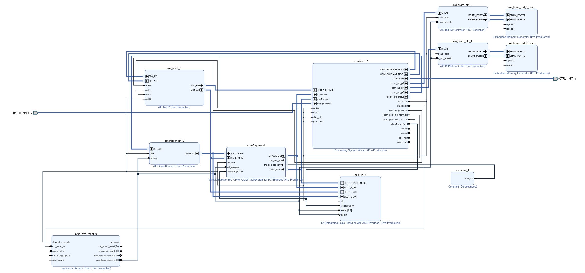
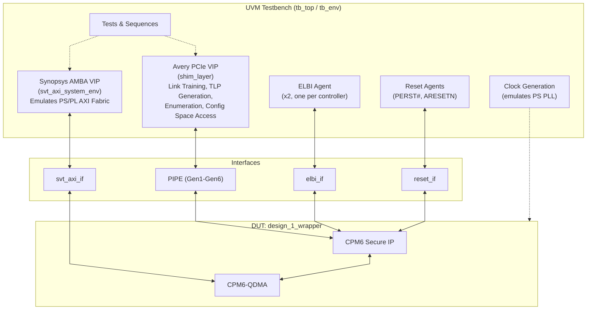
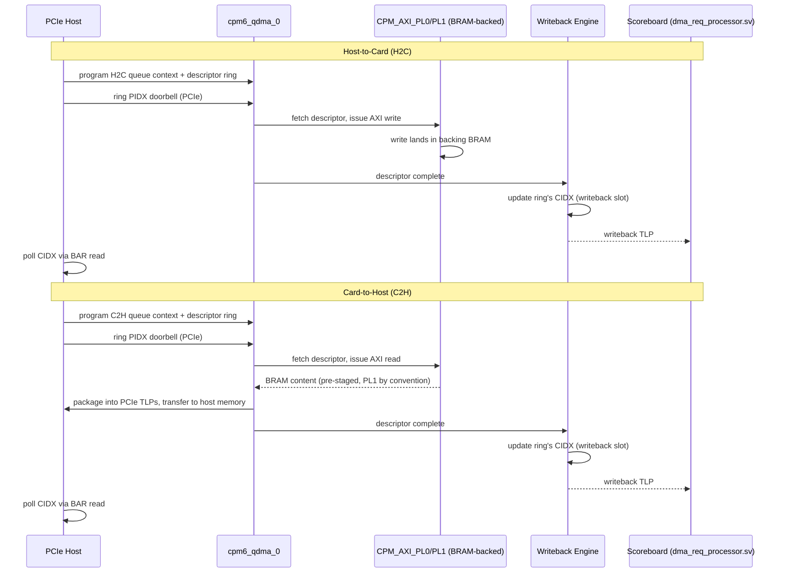
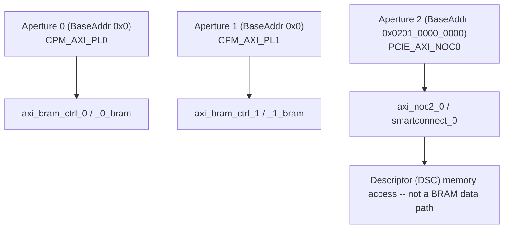

# Versal_CPM6_QDMA_Design

## Introduction

| Item | Summary |
|---|---|
| **Primary Purpose** | Demonstrates the CPM6 QDMA IP core (`cpm6_qdma_v1_0`) -- a multi-queue, context-based DMA IP built in PL fabric on top of the CPM6 hard IP's DMA Bridge interface -- with H2C/C2H descriptor-ring traffic |
| **Configurations** | Single variant: CPM6 Controller 1 only (`ctrl1/`); `Controller_0`/`Dual_Controller` are not yet offered |
| **Example Type** | IP Example Design (CED) |
| **Target Audience** | Verification/FPGA engineers validating the CPM6 QDMA IP core's multi-queue DMA datapath |
| **Devices Supported** | Versal devices with CPM6 hard IP (`vsvc3340` package family) -- `xc2vp3602-vsvc3340-2MHP-e-S` |
| **Tools Required** | Vivado 2026.1.1, VCS/Verdi X-2025.06-SP2 with UVM 1.1, Avery PLI/apci-xactor 2025.3_1, CPM6 Secure IP package |
| **Simulators Validated** | VCS (waveform viewing via Verdi) |
| **Boards Validated** | N/A -- no board is registered; this CED is part-only |
| **Pre-Built Images** | Not available |
| **Key Features Shown** | Multi-queue H2C/C2H MM DMA via `cpm6_qdma_v1_0`'s descriptor-ring engine, SR-IOV (8 VFs behind 1 PF), PCIe Gen6 X2 link, POLL mode |
| **Not Intended For** | Production deployment, performance benchmarking, hardware bring-up (no board/JTAG/PCIe-host flow) |
| **Time to First Success** | ~20-30 minutes (compile + optimize + simulate, order of magnitude) -- not independently measured for this CED |

---

## Overview

This example design demonstrates the CPM6 QDMA IP core (`cpm6_qdma_v1_0`) -- a full multi-queue, context-based DMA IP implemented in PL fabric -- layered on top of CPM6 Controller 1's hard-IP DMA Bridge interface as a PCIe Gen6 Endpoint. The `cpm6_qdma_0` cell here provides real QDMA semantics: per-queue descriptor rings, SW/HW contexts, and a writeback/completion path, all driven by a UVM testbench issuing real PCIe traffic.

By working through this example design, you will learn how to:
- Configure CPM6 Controller 1 in DMA Bridge mode (PCIe Gen6, link width X2) with SR-IOV (1 PF + 8 VFs)
- Program QDMA queue contexts, descriptor rings, and function-map registers over the PCIe link
- Drive multi-queue H2C/C2H DMA traffic and observe per-queue completion via byte-count tracking and writeback
- Build and run the simulation using VCS, with optional Verdi/FSDB waveform viewing

### Included Features

- **Multi-queue H2C/C2H MM DMA** -- descriptor-ring-based host-to-card and card-to-host transfers, one test class covering both directions across an arbitrary number of queues/PFs
- **SR-IOV** -- 1 PF, 8 VFs (`CPM6_CTRL1_SRIOV_CAP_EN=1`, `CPM6_CTRL1_VFG0_TOTAL_VFS=8`)
- **MSI-X interrupt generation** -- 8 vectors/function (`CPM6_CTRL1_PF0_MSIX_VECTORS 8`); POLL (`+IRQ_EN=0`) is the default and preferred completion mode -- INTERRUPT (`+IRQ_EN=1`) is not supported when VFs are in use
- **PCIe Gen6 X2 link** -- lane rate selectable (16.0/32.0/64.0 GT/s) via the CED GUI; link width is fixed at X2 for this CED

## Features

- CPM6 hard IP, Controller 1, configured as a **DMA Bridge** endpoint (`CPM6_CTRL1_MODE=DMA_BRIDGE`, `CPM6_CTRL1_PROTOCOL=PCIE_6_1`) -- the QDMA-specific behavior (rings, contexts) is NOT a CPM6 hard-IP mode; it comes entirely from the `cpm6_qdma_v1_0` PL IP core layered on top (see [Design Architecture](#design-architecture)).
- User-selectable PCIe lane rate (`16.0_GT/s`/`32.0_GT/s`/`64.0_GT/s`) via the CED GUI; link width fixed at `X2`.
- SR-IOV: 1 PF, 8 VFs, `VFG0_FIRST_VF_OFFSET=4`.
- 3 DMA apertures (2 real BRAM-backed PL ports + 1 NoC-routed descriptor (DSC) memory access path) -- see [DMA Subsystem](#dma-subsystem).
- MSI-X: 8 vectors/function, table/PBA offsets `0x14000`/`0x15000`.
- VCS/UVM + Avery PCIe VIP simulation environment with a single, parameterized multi-queue H2C/C2H MM DMA test.

## Design Architecture

At a high level, `cpm6_qdma_0` (the QDMA IP core) sits between CPM6 Controller 1's DMA Bridge (accessed via the MMIO aperture) and the PL-side destinations. The host programs QDMA queue contexts and descriptor rings over PCIe; `cpm6_qdma_0` autonomously fetches descriptors, schedules per-queue transfers, moves data to/from two dedicated BRAM-backed AXI-PL ports (or a third, NoC-routed descriptor-memory access path), and reports completion via writeback and/or MSI-X.



### Host-to-Card (H2C) Path

1. Host driver programs the H2C queue context and descriptor ring for a given queue, then rings the PIDX doorbell over PCIe.
2. `cpm6_qdma_0` fetches the descriptor and issues AXI write transactions toward the destination aperture (`CPM_AXI_PL0`/`PL1`, per the queue's port assignment).
3. The AXI write lands in the aperture's backing BRAM (`axi_bram_ctrl_0`/`_1`).
4. On completion, the writeback engine updates the descriptor ring's CIDX and, if `+IRQ_EN=1`, asserts an MSI-X interrupt for the function.

### Card-to-Host (C2H) Path

1. PL-side BRAM content (pre-staged by the test, port=1/`CPM_AXI_PL1` by convention) is read by `cpm6_qdma_0` per a C2H descriptor.
2. Data is packaged into PCIe TLPs and transferred to host memory.
3. Completion is reported the same way as H2C (writeback CIDX update, optional MSI-X).

## Block Diagram



`cpm6_qdma_g6x2_mm.png` is exported directly from this design's own BD via `write_bd_layout`.

## Files & Infrastructure Diagram

This diagram shows the full UVM testbench stack and how it connects to the DUT boundary.



The Avery PCIe VIP drives link training/enumeration/TLP generation over the PIPE interface
into CPM6's PCIe core; the Synopsys AMBA VIP stands in for the PS/PL AXI fabric (no real PS
is present in this testbench) and connects to CPM6-QDMA's AXI-PL ports; ELBI, reset, and
clock-generation agents provide the remaining sideband connections into CPM6 Secure IP. This
CED ships a single test class, `test_qdma_h2c_c2h_mm_Mfnc_MQ.sv` (see
[Available Tests](#available-tests)), built on the generic `test_base`/`test_init`/`test_enum`/
`base_ep_test` framework chain (`sim/tb/test/`).

## Design Components

| Block design cell | IP | Role |
|---|---|---|
| `cpm6_qdma_0` | CPM6 QDMA (`cpm6_qdma_v1_0`) | The QDMA engine itself -- queue contexts, writeback, MSI-X generation. `num_pfs=1`, `num_queues=256`, `num_vfs=8`, `msix_en=true`, `enable_dbg=true`, `traf_man_intf=true`. |
| `ps_wizard_0` | Processing System Wizard (CIPS) | Hosts the CPM6 hard-IP configuration (`CPM6_CONFIG`) for Controller 1 (PCIe Gen6 DMA-Bridge endpoint) plus PMC/PS configuration. Controller 0 is left disabled in this CED. |
| `axi_noc2_0` | AXI NoC | Routes `DMA_APERTURE2` (`PCIE_AXI_NOC0` destination) -- descriptor (DSC) memory access, not a BRAM data path. `PSW_NOC_*` monitor traffic on this path is descriptor traffic, not H2C/C2H data movement. |
| `smartconnect_0` | SmartConnect | AXI interconnect feeding the NoC-routed aperture path. |
| `axi_bram_ctrl_0` / `_1` | AXI BRAM Controller (v4.1) | Single-port AXI-to-BRAM bridge behind `CPM_AXI_PL0`/`PL1` respectively -- the two real DMA data-path apertures. |
| `axi_bram_ctrl_0_bram` / `_1_bram` | Embedded Memory Generator | Backing block-RAM storage for each `axi_bram_ctrl` instance. |
| `proc_sys_reset_0` | Processor System Reset | Synchronizes PS/PL resets. |
| `axis_ila_1` | Integrated Logic Analyzer | Hardware debug ILA (bitstream-only; not exercised in simulation). |
| `constant_1` | Constant | Tie-off logic. |

## CPM6 Configuration

CPM6 Controller 1 is configured as a PCIe Gen6 DMA Bridge endpoint; Controller 0 is unused. Values below reflect `ps_wizard_0`'s `CPM6_CONFIG` property in the generated block design.

| Property | Value |
|---|---|
| `CPM6_CTRL1_MODE` | `DMA_BRIDGE` |
| `CPM6_CTRL1_PROTOCOL` | `PCIE_6_1` |
| `CPM6_CTRL1_LANE_RATE` | `64.0_GT/s` (default; `16.0`/`32.0` selectable via CED GUI) |
| `CPM6_CTRL1_LINK_WIDTH` | `X2` (fixed for this CED) |
| `CPM6_CTRL1_SRIOV_CAP_EN` | `1` |
| `CPM6_CTRL1_VFG0_TOTAL_VFS` | `8` |
| `CPM6_CTRL1_VFG0_FIRST_VF_OFFSET` | `4` |
| PF0/VFG0 BAR config | BAR0 (`MSIX_BIR`) + BAR1-5, all `Megabytes` scale, `EN=1` |
| MSI-X | `CPM6_CTRL1_PF0_MSIX_EN=1` (and `VFG0_MSIX_EN=1`), 8 vectors, table/PBA offsets `0x14000`/`0x15000` |
| `CPM6_CTRL1_NUM_DMA_APERTURES` | `3` (see [DMA Subsystem](#dma-subsystem)) |
| `CPM6_CTRL1_NUM_MMIO_APERTURES` | `1` (`CPM_AXI_PL3`, base `0x0200_0000`, limit `0x03FF_FFFF`) |
| `CPM6_CTRL1_NUM_INBOUND_REGIONS` | `2` (PF_0 and VFG_0, both target `0x0200_0000`) |
| `CPM6_CTRL1_IDE_CAP_EN` | `0` |
| `CPM6_CTRL1_SELECTIVE_IDE_STREAM_EN` / `LINK_IDE_STREAM_EN` | `1` |
| `CPM6_AXI_PL0_IF` / `PL1_IF` / `PL3_IF` | all `1` (enabled) |
| `PS_USE_PCIE_AXI_NOC0` / `NOC1` | `1` |

### `cpm6_qdma_0` (QDMA IP) Configuration

Values below are read directly from `ctrl1/design_1_bd.tcl`'s `cpm6_qdma_0` cell property list (not inferred).

| Property | Value |
|---|---|
| `CONFIG.cpm6_ctrl` | `1` (bound to CPM6 Controller 1) |
| `CONFIG.num_pfs` | `1` |
| `CONFIG.num_vfs` | `8` |
| `CONFIG.num_queues` | `256` |
| `CONFIG.msix_en` | `true` (8 vectors/function -- see [CPM6 Configuration](#cpm6-configuration)) |
| `CONFIG.enable_dbg` | `true` |
| `CONFIG.traf_man_intf` | `true` |
| `CONFIG.dsc_ram_base_addr` | `0x201_0000_0000` -- matches `DMA_APERTURE2`'s BaseAddr (see [DMA Subsystem](#dma-subsystem)); this value is assigned via Vivado's Address Editor for the `CPM_PCIE_AXI_NOC0` -> descriptor (DSC) memory data path, not an independently-set parameter. |

## DMA Subsystem

`cpm6_qdma_0` implements a descriptor-ring-based, multi-queue H2C/C2H DMA IP (QDMA mode) built in PL fabric. Each configured DMA aperture is an independent address window `cpm6_qdma_0` routes to a PL-AXI or NoC destination.

### DMA Apertures

From `ps_wizard_0`'s `CPM6_CONFIG` (`CPM6_CTRL1_DMA_APERTUREn_BASEADDR`/`LIMITADDR`/`DEST`). Only 2 `axi_bram_ctrl` instances exist in the block design, aperture 2 is NOT a 3rd BRAM port:

| Aperture | BaseAddr | LimitAddr | Destination |
|---|---|---|---|
| 0 | `0x0000_0000_0000_0000` | `0x0000_0000_0000_FFFF` | `CPM_AXI_PL0` (implicit default) -> `axi_bram_ctrl_0` |
| 1 | `0x0000_0000_0000_0000` | `0x0000_0000_0000_FFFF` | `CPM_AXI_PL1` -> `axi_bram_ctrl_1` |
| 2 | `0x0000_0201_0000_0000` | `0x0000_0201_003F_FFFF` | `PCIE_AXI_NOC0` -> `axi_noc2_0`/`smartconnect_0` (descriptor (DSC) memory access, not a BRAM data path) |

Both PL0 and PL1 apertures are based at `0x0`, 64 KB window each (matches the testbench's `PL_BRAM_APERTURE_SIZE=65536`). **Both apertures share the identical `0x0-0xFFFF` address range** -- the disambiguator between PL0 vs PL1 is a separate address bit convention, not the aperture range itself.

### DMA data flow diagram



Completion is reported through two independent mechanisms, selectable per test run: **writeback** (always active, tracked by the testbench scoreboard independent of interrupt mode) and **MSI-X** (`+IRQ_EN=1`, one interrupt per completing queue/function, 8 vectors/function -- not supported when VFs are in use).

## Memory Architecture



### PL-AXI Local Memory (H2C/C2H data path)

Two `axi_bram_ctrl` (v4.1, single-port) + embedded-memory-generator pairs back `CPM_AXI_PL0`/`PL1`, each decoding a 64 KB window (`0x0-0xFFFF`) -- see [DMA Apertures](#dma-apertures). These are the only two real DMA data-path apertures in this CED.

### NoC-Routed Descriptor Memory Access

Aperture 2 (`PCIE_AXI_NOC0` destination) routes through `axi_noc2_0`/`smartconnect_0` to descriptor (DSC) memory access, not a 3rd BRAM data port (confirmed against the block design's actual cell list: only 2 `axi_bram_ctrl` instances exist).

## Build Instructions

### Prerequisites

- Vivado 2026.1.1.
- VCS / Verdi -- X-2025.06-SP2 (Verdi 2025.06-SP2-2 optional, waveforms).
- UVM Library -- 1.1.
- Avery PLI -- 2025.3_1.
- Avery apci-xactor (PCIe VIP) -- 2025.3_1.
- CPM6 Secure IP package (obtained separately: https://account.amd.com/en/member/cpm6-simulation.html).

### Project Generation Steps

1. In Vivado, click **Open Example Project**, then **Next** on the launch dialog.
2. In **Select Project Template**, search for and select **"Versal CPM6 QDMA Design"**, then click **Next**.
3. Choose the project name and location.
4. Select the supported part (`xc2vp3602-vsvc3340-2MHP-e-S`) -- no board selection is offered.
5. On the **CPM6 QDMA Configuration** page, choose:
   - **Controller selection**: `Controller_1` (the only option offered).
   - **Link Speed** (`CTRL_LANE_RATE`): `16.0`/`32.0`/`64.0_GT/s`.
   - **Link width** (`CTRL_LINK_WIDTH`): `X2` (the only option offered -- this is the CED's target link width, not a limitation).
6. Review the summary page and click **Finish**.

This single step also generates the VCS simulation scripts and copies the `sim/` directory alongside the Vivado project -- no separate `launch_simulation` step is needed.

### What Happens on Generation

`run.tcl` (invoked by `init.tcl` via the CED GUI, or directly via `instantiate_example_design`) does the following for the single `Controller_1` configuration:

1. Imports the CED's top-level `src/` plus `ctrl1/src/` into the `sources_1` fileset.
2. Regenerates `defines.sv` (`qdma_link_pkg`) in the **project** directory (not the CED source dir, to avoid permission issues on a shared/read-only checkout) with the selected `LINK_WIDTH`/`LANE_RATE`.
3. Sets the top-level module to `ctrl1_qdma_ep` and sources `ctrl1/design_1_bd.tcl` to build the block design, then regenerates the BD layout.
4. Copies the shared `sim/` testbench tree alongside the generated project (skipped if `sim/` already exists there).
5. Configures the `sim_1` fileset for VCS (`generate_scripts_only`, top module `ctrl1_qdma_ep`), using `$VIVADO_CLIBS` for `compxlib.vcs_compiled_library_dir` if set (falls back to Vivado's default compiled-library path with a warning if unset), then runs `launch_simulation -scripts_only`.

### Expected Outputs

- A Vivado project containing the generated `cpm6_qdma` block design, the imported `ctrl1_qdma_ep`/CED `src/` RTL, and the regenerated `defines.sv`.
- A `sim/` directory in the generated project, staged for VCS/UVM simulation (no bitstream/hardware build target is exercised by this CED's intended flow).

### Running Tests

From `<generated_project>/sim` (see `ctrl1/sim/Makefile`):

| Command | Effect |
|---|---|
| `make cos` | Compile + optimize + simulate |
| `make cos DUMP=1 DEBUG=1 VERDI=1` | Same, with FSDB waveform dump (dump start delayed past CDO load -- see `DUMP_START_TIME`, default `362us`) |
| `make s PARG_EXTRA="+NUM_PF_TEST=1 +NUM_VF_TEST=8 +NUM_Q_TEST=1 +PIDX=7 +DMA_BYTE_CNT=512 +DIRECTION=BOTH"` | Re-simulate with specific plusargs, no rebuild (values shown are the Makefile's own default) |
| `make s SEED=<n>` | Re-simulate with an exact prior run's seed (reproduce randomized plusarg choices bit-for-bit) |
| `make smoke` | Run the smoke test (`test_qdma_h2c_c2h_mm_Mfnc_MQ`) only |
| `make distclean` | Wipe all compiled libs and start completely fresh |
| `make h` | Show all Makefile options |

### Available Tests

This CED ships a single test class, `test_qdma_h2c_c2h_mm_Mfnc_MQ` -- multi-queue, H2C+C2H MM DMA across PF and/or VF functions. Configured entirely via plusargs (see `test_qdma_h2c_c2h_mm_Mfnc_MQ.sv`'s header for the full list): `NUM_PF_TEST`/`NUM_VF_TEST`/`NUM_Q_TEST`/`PIDX`/`DMA_BYTE_CNT`/`IRQ_EN`/`DIRECTION`/`NUM_DMA_PORTS`, plus `SEED=<n>` (Makefile-level) to reproduce an exact prior run. Default (no-plusarg) randomization is capped -- `NUM_Q_TEST<=4`, `PIDX<=50`, `DMA_BYTE_CNT<=4096` (added 2026-09-03 after an unconstrained random draw, `NUM_Q_TEST=21`/`PIDX=51`/`DMA_BYTE_CNT=14208`, produced an excessively large/slow run) -- explicit plusargs bypass this cap up to the class-level constraint range.

## Performance Considerations

- **Link bandwidth**: default configuration is PCIe Gen6 X2 (`64.0_GT/s` x 2 lanes) -- the theoretical maximum raw link bandwidth for this CED's default settings; lower lane rates (`16.0`/`32.0_GT/s`) are selectable via the CED GUI; link width is fixed at `X2` for this CED.
- **Aperture window size caps single-transfer addressability**: `CPM_AXI_PL0`/`PL1` apertures each decode only a 64 KB window (`0x0-0xFFFF`); transfers must stay within that decoded window, not any larger BAR/address space.
- **MSI-X vector sharing under SR-IOV**: 8 MSI-X vectors are available per function; SR-IOV enables 8 VFs behind the 1 PF. INTERRUPT mode is not supported with VFs, so multi-VF runs rely on the always-active writeback CIDX update plus host-side POLL, not per-queue MSI-X, for completion detection.
- No formal hardware performance/throughput measurement flow is included in this CED (simulation-only, PIPE validation) -- the above are structural bandwidth/addressability bounds inferred from the configuration, not measured results.

## Validation Flow

This CED provides a **simulation-only** validation flow; there is no hardware test bench, board bring-up procedure, or PCIe-host driver flow included.

### Simulation Setup

1. Download and unzip the CPM6 Secure IP package (provided separately) from https://account.amd.com/en/member/cpm6-simulation.html
2. Set the following environment variables (tcsh or bash shell):
   - `AVERY_PLI` -- Avery PLI binary location
     ```
     tcsh: setenv AVERY_PLI <path to avery pli install>
     bash: export AVERY_PLI=<path to avery pli install>
     ```
   - `AVERY_PCIE` -- Avery PCIe source libraries
     ```
     tcsh: setenv AVERY_PCIE <path to avery apci xactor install>
     bash: export AVERY_PCIE=<path to avery apci xactor install>
     ```
   - `CPM6_SECUREIP` -- directory where the CPM6 Secure IP package was extracted
     ```
     tcsh: setenv CPM6_SECUREIP <path to extracted cpm6 secureip>
     bash: export CPM6_SECUREIP=<path to extracted cpm6 secureip>
     ```
   - `VIVADO_CLIBS` -- directory containing your precompiled VCS simulation libraries for the selected Vivado/VCS version
     ```
     tcsh: setenv VIVADO_CLIBS <path to compiled simlibs>
     bash: export VIVADO_CLIBS=<path to compiled simlibs>
     ```
   Verify:
   ```
   echo $VCS_HOME       # should show X-2025.06-SP2 path
   echo $AVERY_PLI      # should show avery_pli-2025.3_1 path
   echo $AVERY_PCIE     # should show apcievip-2025.3_1 path
   echo $CPM6_SECUREIP  # should show your extracted path
   echo $VIVADO_CLIBS   # should show your compiled simlib path
   ```
3. In the Vivado Tcl console (this CED is bundled with Vivado, so no `repoPaths` setup is needed) -- substitute the desired `CTRL_LANE_RATE` option (see [Build Instructions](#build-instructions)):
   ```
   create_project <project_name> <output_dir>/<project_name> -part xc2vp3602-vsvc3340-2MHP-e-S
   create_bd_design "cpm6_qdma" -mode batch
   instantiate_example_design -template xilinx.com:design:cpm6_qdma:1.0 \
       -design cpm6_qdma -options { CTRL_CONFIG.VALUE Controller_1 CTRL_LANE_RATE.VALUE 64.0_GT/s }
   ```
   Or, via the GUI: File -> Project -> New (or IP Catalog -> Example Designs) and select "Versal CPM6 QDMA Design".
4. This single step also generates the VCS simulation scripts and copies the `sim/` directory alongside the Vivado project -- no separate `launch_simulation` step is needed.

**Expected outcome:**
The Vivado project is created, and `<project_name>/sim/` contains the `Makefile`, `test/`, `tb/`, and `verif/` directories ready to build.

## Debug Hints

- **Opt/elaboration fails with `Error-[SFCOR] Source file cannot be opened`** on `cpm6_001.svp`/`cpm6_002.svp`/`CPM6.v` -- **not expected on a first-time run that follows [Prerequisites](#prerequisites) exactly.** It occurs when the project is generated with a Vivado build *other than* the pinned one (e.g. a newer install picked up from `PATH`, or a different install used for a re-run of an existing project): that build's `cpm6_sip.f` is generated expecting the nested secure-IP layout (`$CPM6_SECUREIP/data/secureip/cpm6/...`, `$CPM6_SECUREIP/data/verilog/src/unisims/CPM6.v`), while the CPM6 Secure IP package obtained per Prerequisites has a flat layout. Re-generating the project with the pinned Vivado build is the real fix. If switching Vivado builds isn't practical, a symlink shim works around it -- run from `<generated_project>` (the parent of the `sim/` directory used in [Running Tests](#running-tests), not from inside it):
  ```
  mkdir -p sim/.cpm6_secureip_shim/data/secureip/cpm6 \
           sim/.cpm6_secureip_shim/data/verilog/src/unisims
  ln -s $CPM6_SECUREIP/cpm6_001.svp sim/.cpm6_secureip_shim/data/secureip/cpm6/
  ln -s $CPM6_SECUREIP/cpm6_002.svp sim/.cpm6_secureip_shim/data/secureip/cpm6/
  ln -s $CPM6_SECUREIP/CPM6.v sim/.cpm6_secureip_shim/data/verilog/src/unisims/
  setenv CPM6_SECUREIP <generated_project>/sim/.cpm6_secureip_shim
  ```
  then `make distclean` (a prior compile attempt against the wrong layout leaves a broken stub in `clibs/cpm6_secip` that must be wiped) before `make cos` from `<generated_project>/sim`.
- **`_check_vivado` reports "compile.sh not found"** even though it exists -- a stale `sim/simv.daidir` from a prior run can make the VIVADO_SIM auto-detect match its own embedded path mirror instead of the real Vivado sim dir.
- **CDO load or PCIe enumeration appears extremely slow or stalled** -- check the `+PL0_CLK` value printed by `bind.ps_vip.sv` at sim start; it should read a few hundred MHz. A malformed Hz->MHz conversion can produce a value ~1000x too high, generating an extreme number of clock-edge events under the 1fs sim timescale.
- **PCIe enumeration never produces any protocol-layer activity** (`tracker_*.log` files stay at 0 bytes, no avypcie version banner -- looks exactly like a hang, no error printed) -- the Avery license client may never have completed feature checkout. Verify `AVERY_PLI` is a version-matched PLI+VIP bundle (not a standalone install of a different version than `AVERY_PCIE`), and that `SALT_LICENSE_SERVER` carries no dead/unreachable entry.
- **`UVM_FATAL` in `shim_api.sv`** on a completion status other than Successful Completion, after enumeration otherwise succeeds -- the framework may be walking VF Extended Capability space while SR-IOV VF Enable is still 0 (the DUT correctly returns UR for those accesses). Guard the VF capability traverse on the SR-IOV VF Enable bit.
- **H2C/C2H DMA transfers stall partway with no further host-side byte-count progress** -- check that `H2C_DAT_DST_ADDR0/1` in `pkg.cpm6_qdma_params.sv` still match the DMA aperture `BASEADDR` the BD's Address Editor assigns to each `CPM_AXI_PLn` port. A stale constant here can numerically alias to an unrelated address region and silently target the wrong destination.
- **SEED sensitivity** -- VCS's automatic seed (`+ntb_random_seed_automatic`, the default) picks a different pseudo-random stimulus profile every launch, which at higher VF counts can affect whether Avery's PCIe VIP clears bus enumeration within its fixed 500 us window. If a launch fails during PCIe/SR-IOV enumeration with no other change, try a different explicit `SEED=<n>` before assuming a real regression (the seed used is always printed in `vcs.sim.log`), or `SEED=automatic` to go back to VCS's own randomization.
- **`svt_axi_system_configuration` "set_addr_range ... overlaps" `UVM_WARNING`** -- expected and benign, not a testbench bug. `tb_env.sv` deliberately gives each of 6 physically distinct AXI slave ports the full 64-bit address range, since each is a separate physical interface rather than a decoded sub-region of one shared address map. Do not narrow these ranges to "fix" the warning -- it would silently drop valid accesses on that port.
