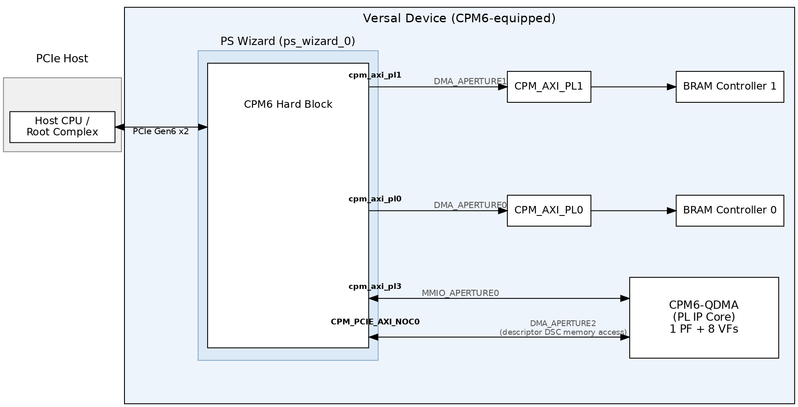
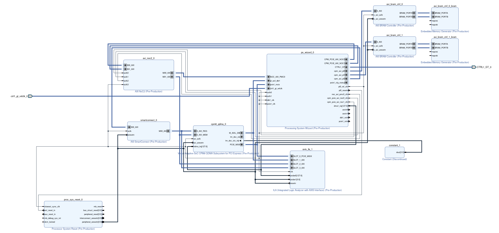
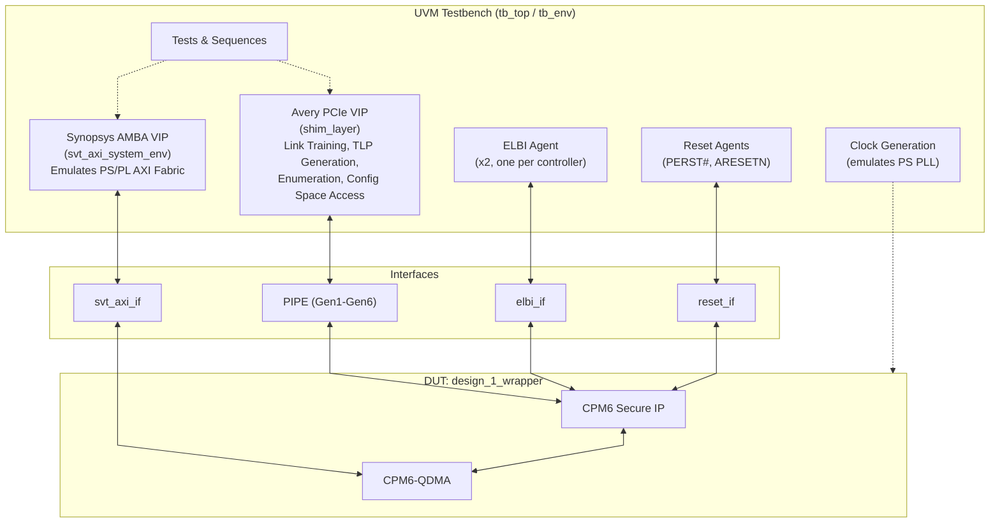
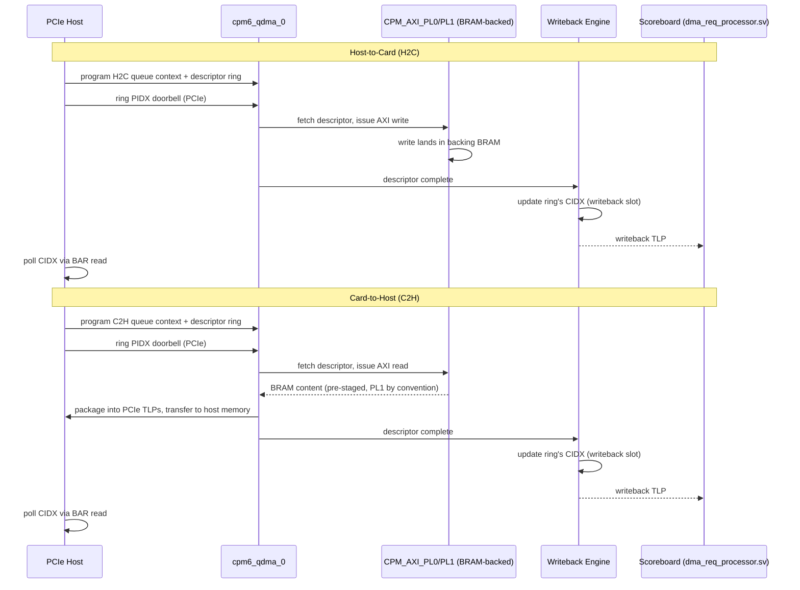
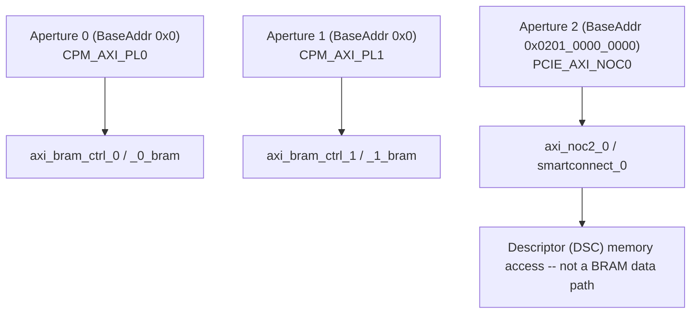

# Versal_CPM6_QDMA_Design

## Introduction

| Item | Summary |
|---|---|
| **Primary Purpose** | Demonstrates the CPM6 QDMA IP core (`cpm6_qdma_v1_0`) -- a multi-queue, context-based DMA IP built in PL fabric on top of the CPM6 hard IP's DMA Bridge interface -- with H2C/C2H descriptor-ring traffic |
| **Configurations** | Single variant: CPM6 Controller 1 only (`ctrl1/`); `Controller_0`/`Dual_Controller` are not yet offered |
| **Example Type** | IP Example Design (CED) |
| **Target Audience** | Verification/FPGA engineers validating the CPM6 QDMA IP core's multi-queue DMA datapath |
| **Devices Supported** | Versal devices with CPM6 hard IP (`vsvc3340` package family) -- `xc2vp3602-vsvc3340-2MHP-e-S` |
| **Tools Required** | Vivado 2026.1.1, VCS/Verdi X-2025.06-SP2 with UVM 1.1, Avery PLI/apci-xactor 2025.3_1, CPM6 Secure IP package |
| **Simulators Validated** | VCS (waveform viewing via Verdi) |
| **Board Part** | None selected -- the design targets the supported part directly |
| **Key Features Shown** | Multi-queue H2C/C2H MM DMA via `cpm6_qdma_v1_0`'s descriptor-ring engine, SR-IOV (8 VFs behind 1 PF), PCIe Gen6 X2 link, POLL mode |
| **Not Intended For** | Production deployment, performance benchmarking |
| **Time to First Success** | ~20-30 minutes (compile + optimize + simulate) |

---

## Overview

This example design demonstrates the CPM6 QDMA IP core (`cpm6_qdma_v1_0`) -- a full multi-queue, context-based DMA IP implemented in PL fabric -- layered on top of CPM6 Controller 1's hard-IP DMA Bridge interface as a PCIe Gen6 Endpoint. The `cpm6_qdma_0` cell here provides real QDMA semantics: per-queue descriptor rings, SW/HW contexts, and a writeback/completion path, all driven by a UVM testbench issuing real PCIe traffic.

By working through this example design, you will learn how to:
- Configure CPM6 Controller 1 in DMA Bridge mode (PCIe Gen6, link width X2) with SR-IOV (1 PF + 8 VFs)
- Program QDMA queue contexts, descriptor rings, and function-map registers over the PCIe link
- Drive multi-queue H2C/C2H DMA traffic and observe per-queue completion via byte-count tracking and writeback
- Build and run the simulation using VCS, with optional Verdi/FSDB waveform viewing

### Included Features

- **Multi-queue H2C/C2H MM DMA** -- descriptor-ring-based host-to-card and card-to-host transfers, one test class covering both directions across an arbitrary number of queues/PFs
- **SR-IOV** -- 1 PF, 8 VFs (`CPM6_CTRL1_SRIOV_CAP_EN=1`, `CPM6_CTRL1_VFG0_TOTAL_VFS=8`)
- **MSI-X interrupt generation** -- 8 vectors/function (`CPM6_CTRL1_PF0_MSIX_VECTORS 8`); POLL (`+IRQ_EN=0`) is the default and preferred completion mode -- INTERRUPT (`+IRQ_EN=1`) is not supported when VFs are in use
- **PCIe Gen6 X2 link** -- lane rate selectable (16.0/32.0/64.0 GT/s) via the CED GUI; link width is fixed at X2 for this CED

## Features

- CPM6 hard IP, Controller 1, configured as a **DMA Bridge** endpoint (`CPM6_CTRL1_MODE=DMA_BRIDGE`, `CPM6_CTRL1_PROTOCOL=PCIE_6_1`) -- the QDMA-specific behavior (rings, contexts) is NOT a CPM6 hard-IP mode; it comes entirely from the `cpm6_qdma_v1_0` PL IP core layered on top (see [Design Architecture](#design-architecture)).
- SR-IOV: 1 PF, 8 VFs, `VFG0_FIRST_VF_OFFSET=4`.
- 3 DMA apertures (2 real BRAM-backed PL ports + 1 NoC-routed descriptor (DSC) memory access path) -- see [DMA Subsystem](#dma-subsystem).
- MSI-X: 8 vectors/function, table/PBA offsets `0x14000`/`0x15000`.
- VCS/UVM + Avery PCIe VIP simulation environment with a single, parameterized multi-queue H2C/C2H MM DMA test.

## Choosing a Configuration

These are the only options presented at generation time; everything else in the block design is set by the CED.

| CED GUI option | Parameter | Values | Default |
|---|---|---|---|
| Controller selection | `CTRL_CONFIG.VALUE` | `Controller_1` | `Controller_1` |
| Link Speed | `CTRL_LANE_RATE.VALUE` | `64.0_GT/s`, `32.0_GT/s`, `16.0_GT/s` | `64.0_GT/s` |
| Link width | `CTRL_LINK_WIDTH.VALUE` | `X2` | `X2` |

The generated DUT top-level module is `ctrl1_qdma_ep`.

## Design Architecture

At a high level, `cpm6_qdma_0` (the QDMA IP core) sits between CPM6 Controller 1's DMA Bridge (accessed via the MMIO aperture) and the PL-side destinations. The host programs QDMA queue contexts and descriptor rings over PCIe; `cpm6_qdma_0` autonomously fetches descriptors, schedules per-queue transfers, moves data to/from two dedicated BRAM-backed AXI-PL ports (or a third, NoC-routed descriptor-memory access path), and reports completion via writeback and/or MSI-X.



### Host-to-Card (H2C) Path

1. Host driver programs the H2C queue context and descriptor ring for a given queue, then rings the PIDX doorbell over PCIe.
2. `cpm6_qdma_0` fetches the descriptor and issues AXI write transactions toward the destination aperture (`CPM_AXI_PL0`/`PL1`, per the queue's port assignment).
3. The AXI write lands in the aperture's backing BRAM (`axi_bram_ctrl_0`/`_1`).
4. On completion, the writeback engine updates the descriptor ring's CIDX and, if `+IRQ_EN=1`, asserts an MSI-X interrupt for the function.

### Card-to-Host (C2H) Path

1. PL-side BRAM content (pre-staged by the test, port=1/`CPM_AXI_PL1` by convention) is read by `cpm6_qdma_0` per a C2H descriptor.
2. Data is packaged into PCIe TLPs and transferred to host memory.
3. Completion is reported the same way as H2C (writeback CIDX update, optional MSI-X).

## Block Diagram



## Files & Infrastructure Diagram

This diagram shows the full UVM testbench stack and how it connects to the DUT boundary.


```mermaid
%%{init: {'flowchart': {'curve': 'linear'}}}%%
flowchart TB
    subgraph TBENV["UVM Testbench (tb_top / tb_env)"]
        AVERY["Avery PCIe VIP<br/>(shim_layer)<br/>Link Training, TLP Generation,<br/>Enumeration, Config Space Access"]
        AMBA["Synopsys AMBA VIP<br/>(svt_axi_system_env)<br/>Emulates PS/PL AXI Fabric"]
        ELBIAgt["ELBI Agent<br/>(x2, one per controller)"]
        RESET["Reset Agents<br/>(PERST#, ARESETN)"]
        CLK["Clock Generation<br/>(emulates PS PLL)"]
        TESTS["Tests & Sequences"]
    end

    subgraph IF["Interfaces"]
        PIPE["PIPE (Gen1-Gen6)"]
        AXIIF["svt_axi_if"]
        ELBIIF["elbi_if"]
        RSTIF["reset_if"]
    end

    subgraph DUT["DUT: design_1_wrapper"]
        CPM6SEC["CPM6 Secure IP"]
        QDMAB["CPM6-QDMA"]
    end

    TESTS -.-> AVERY
    TESTS -.-> AMBA

    AVERY <--> PIPE
    PIPE <--> CPM6SEC
    AMBA <--> AXIIF
    AXIIF <--> QDMAB
    ELBIAgt <--> ELBIIF
    ELBIIF <--> CPM6SEC
    RESET <--> RSTIF
    RSTIF <--> CPM6SEC
    CLK -.-> DUT
    CPM6SEC <--> QDMAB
```

The Avery PCIe VIP drives link training/enumeration/TLP generation over the PIPE interface
into CPM6's PCIe core; the Synopsys AMBA VIP stands in for the PS/PL AXI fabric (no real PS
is present in this testbench) and connects to CPM6-QDMA's AXI-PL ports; ELBI, reset, and
clock-generation agents provide the remaining sideband connections into CPM6 Secure IP. This
CED ships a single test class, `test_qdma_h2c_c2h_mm_Mfnc_MQ.sv` (see
[Available Tests](#available-tests)), built on the generic `test_base`/`test_init`/`test_enum`/
`base_ep_test` framework chain (`sim/tb/test/`).

## Design Components

| Block design cell | IP | Role |
|---|---|---|
| `cpm6_qdma_0` | CPM6 QDMA (`cpm6_qdma_v1_0`) | The QDMA engine itself -- queue contexts, descriptor fetch, writeback, MSI-X generation. |
| `ps_wizard_0` | Processing System Wizard (CIPS) | Hosts the CPM6 hard-IP configuration (`CPM6_CONFIG`) for Controller 1 (PCIe Gen6 DMA-Bridge endpoint) plus PMC/PS configuration. Controller 0 is left disabled in this CED. |
| `axi_noc2_0` | AXI NoC | Routes `DMA_APERTURE2` (`PCIE_AXI_NOC0` destination) -- descriptor (DSC) memory access, not a BRAM data path. `PSW_NOC_*` monitor traffic on this path is descriptor traffic, not H2C/C2H data movement. |
| `smartconnect_0` | SmartConnect | AXI interconnect feeding the NoC-routed aperture path. |
| `axi_bram_ctrl_0` / `_1` | AXI BRAM Controller (v4.1) | Single-port AXI-to-BRAM bridge behind `CPM_AXI_PL0`/`PL1` respectively -- the two real DMA data-path apertures. |
| `axi_bram_ctrl_0_bram` / `_1_bram` | Embedded Memory Generator | Backing block-RAM storage for each `axi_bram_ctrl` instance. |
| `proc_sys_reset_0` | Processor System Reset | Synchronizes PS/PL resets. |
| `axis_ila_1` | Integrated Logic Analyzer | Hardware debug ILA. |
| `constant_1` | Constant | Tie-off logic. |

## DMA Subsystem

`cpm6_qdma_0` implements a descriptor-ring-based, multi-queue H2C/C2H DMA IP (QDMA mode) built in PL fabric. Each configured DMA aperture is an independent address window `cpm6_qdma_0` routes to a PL-AXI or NoC destination.

### DMA Apertures

Each aperture is an independent address window routed to a PL-AXI or NoC destination. Only apertures 0 and 1 are BRAM-backed data paths; aperture 2 is descriptor-memory access:

| Aperture | BaseAddr | LimitAddr | Destination |
|---|---|---|---|
| 0 | `0x0000_0000_0000_0000` | `0x0000_0000_0000_FFFF` | `CPM_AXI_PL0` (implicit default) -> `axi_bram_ctrl_0` |
| 1 | `0x0000_0000_0000_0000` | `0x0000_0000_0000_FFFF` | `CPM_AXI_PL1` -> `axi_bram_ctrl_1` |
| 2 | `0x0000_0201_0000_0000` | `0x0000_0201_003F_FFFF` | `PCIE_AXI_NOC0` -> `axi_noc2_0`/`smartconnect_0` (descriptor (DSC) memory access, not a BRAM data path) |

Both PL0 and PL1 apertures are based at `0x0`, 64 KB window each (matches the testbench's `PL_BRAM_APERTURE_SIZE=65536`). **Both apertures share the identical `0x0-0xFFFF` address range** -- the disambiguator between PL0 vs PL1 is a separate address bit convention, not the aperture range itself.

### DMA data flow diagram


```mermaid
sequenceDiagram
    participant Host as PCIe Host
    participant Q as cpm6_qdma_0
    participant PL as CPM_AXI_PL0/PL1 (BRAM-backed)
    participant WB as Writeback Engine
    participant SB as Scoreboard (dma_req_processor.sv)

    Note over Host,SB: Host-to-Card (H2C)
    Host->>Q: program H2C queue context + descriptor ring
    Host->>Q: ring PIDX doorbell (PCIe)
    Q->>PL: fetch descriptor, issue AXI write
    PL->>PL: write lands in backing BRAM
    Q->>WB: descriptor complete
    WB->>WB: update ring's CIDX (writeback slot)
    WB-->>SB: writeback TLP
    Host->>Host: poll CIDX via BAR read

    Note over Host,SB: Card-to-Host (C2H)
    Host->>Q: program C2H queue context + descriptor ring
    Host->>Q: ring PIDX doorbell (PCIe)
    Q->>PL: fetch descriptor, issue AXI read
    PL-->>Q: BRAM content (pre-staged, PL1 by convention)
    Q->>Host: package into PCIe TLPs, transfer to host memory
    Q->>WB: descriptor complete
    WB->>WB: update ring's CIDX (writeback slot)
    WB-->>SB: writeback TLP
    Host->>Host: poll CIDX via BAR read
```

Completion is reported through two independent mechanisms, selectable per test run: **writeback** (always active, tracked by the testbench scoreboard independent of interrupt mode) and **MSI-X** (`+IRQ_EN=1`, one interrupt per completing queue/function, 8 vectors/function -- not supported when VFs are in use).

## Memory Architecture


```mermaid
flowchart TB
    A0["Aperture 0 (BaseAddr 0x0)<br/>CPM_AXI_PL0"] --> B0[axi_bram_ctrl_0 / _0_bram]
    A1["Aperture 1 (BaseAddr 0x0)<br/>CPM_AXI_PL1"] --> B1[axi_bram_ctrl_1 / _1_bram]
    A2["Aperture 2 (BaseAddr 0x0201_0000_0000)<br/>PCIE_AXI_NOC0"] --> N1[axi_noc2_0 / smartconnect_0] --> DSC["Descriptor (DSC) memory access -- not a BRAM data path"]
```

### PL-AXI Local Memory (H2C/C2H data path)

Two `axi_bram_ctrl` (v4.1, single-port) + embedded-memory-generator pairs back `CPM_AXI_PL0`/`PL1`, each decoding a 64 KB window (`0x0-0xFFFF`) -- see [DMA Apertures](#dma-apertures). These are the only two real DMA data-path apertures in this CED.

### NoC-Routed Descriptor Memory Access

Aperture 2 (`PCIE_AXI_NOC0` destination) routes through `axi_noc2_0`/`smartconnect_0` to descriptor (DSC) memory access, not a 3rd BRAM data port.

The QDMA core's `dsc_ram_base_addr` (`0x201_0000_0000`) must match this aperture's `BaseAddr`. Vivado's Address Editor assigns it for the `CPM_PCIE_AXI_NOC0` -> descriptor-memory path rather than it being set independently, so changing one without the other breaks descriptor fetch.

## Getting Started

### Prerequisites

- Vivado 2026.1.1.
- VCS / Verdi -- X-2025.06-SP2 (Verdi 2025.06-SP2-2 optional, waveforms).
- UVM Library -- 1.1.
- Avery PLI -- 2025.3_1.
- Avery apci-xactor (PCIe VIP) -- 2025.3_1.
- CPM6 Secure IP package (obtained separately: https://account.amd.com/en/member/cpm6-simulation.html).

### Generating the Example

1. Download and unzip the CPM6 Secure IP package (provided separately) from https://account.amd.com/en/member/cpm6-simulation.html
   Use the package built for the Vivado version in [Prerequisites](#prerequisites) -- the directory layout differs between releases and the generated `cpm6_sip.f` expects the layout of its own release, so mixing versions fails at elaboration with `Error-[SFCOR] Source file cannot be opened` on the secure-IP sources.
2. Set the following environment variables (tcsh or bash shell):
   - `AVERY_PLI` -- Avery PLI binary location
     ```
     tcsh: setenv AVERY_PLI <path to avery pli install>
     bash: export AVERY_PLI=<path to avery pli install>
     ```
     Use the `avery_pli-<ver>` that ships alongside `apcievip-<ver>` in the same bundle as `AVERY_PCIE`/`AVERY_SIM`, not a standalone install of a different version. A mismatched PLI -- or a dead entry in `SALT_LICENSE_SERVER`/`MGLS_LICENSE_FILE` -- stops the Avery license client completing feature checkout, and the run then stalls silently: `tracker_*.log` files stay at 0 bytes, no avypcie banner is printed, and no error is issued.
   - `AVERY_PCIE` -- Avery PCIe source libraries
     ```
     tcsh: setenv AVERY_PCIE <path to avery apci xactor install>
     bash: export AVERY_PCIE=<path to avery apci xactor install>
     ```
   - `CPM6_SECUREIP` -- directory where the CPM6 Secure IP package was extracted
     ```
     tcsh: setenv CPM6_SECUREIP <path to extracted cpm6 secureip>
     bash: export CPM6_SECUREIP=<path to extracted cpm6 secureip>
     ```
   - `VIVADO_CLIBS` -- directory containing your precompiled VCS simulation libraries for the selected Vivado/VCS version
     ```
     tcsh: setenv VIVADO_CLIBS <path to compiled simlibs>
     bash: export VIVADO_CLIBS=<path to compiled simlibs>
     ```
   Verify:
   ```
   echo $VCS_HOME       # should show X-2025.06-SP2 path
   echo $AVERY_PLI      # should show avery_pli-2025.3_1 path
   echo $AVERY_PCIE     # should show apcievip-2025.3_1 path
   echo $CPM6_SECUREIP  # should show your extracted path
   echo $VIVADO_CLIBS   # should show your compiled simlib path
   ```
3. Via the GUI: File -> Project -> New (or IP Catalog -> Example Designs) and select "Versal CPM6 QDMA Design", then set the options on the **CPM6 QDMA Configuration** page -- see [Choosing a Configuration](#choosing-a-configuration).

   Alternately, users can use command line options in the Vivado Tcl console -- substitute the desired `CTRL_LANE_RATE`:
   ```
   create_project <project_name> <output_dir>/<project_name> -part xc2vp3602-vsvc3340-2MHP-e-S
   create_bd_design "cpm6_qdma" -mode batch
   instantiate_example_design -template xilinx.com:design:cpm6_qdma:1.0 \
       -design cpm6_qdma -options { CTRL_CONFIG.VALUE Controller_1 CTRL_LANE_RATE.VALUE 64.0_GT/s }
   ```
4. This single step also generates the VCS simulation scripts and copies the `sim/` directory alongside the Vivado project -- no separate `launch_simulation` step is needed.

**Expected outcome:**
The Vivado project is created, and `<project_name>/sim/` contains the `Makefile`, `test/`, `tb/`, and `verif/` directories ready to build.

### Simulating the Example

1. `cd <project_name>/sim`
2. `make cos` -- compile + optimize + simulate
3. `make cos DUMP=1 DEBUG=1 VERDI=1` -- same, with FSDB waveform dump (the dump start is delayed past CDO load; see `DUMP_START_TIME`, default `362us`)
4. `make s PARG_EXTRA="+NUM_Q_TEST=2 +DIRECTION=BOTH"` -- re-simulate with different plusargs, no rebuild. Plusargs **must** be passed inside `PARG_EXTRA="..."`; a bare `+ARG=VAL` on the `make` command line is silently dropped and the run falls back to the Makefile defaults.
5. `make s SEED=<n>` -- reproduce an exact prior run bit-for-bit (the seed used is printed in `vcs.sim.log`)
6. `make distclean` -- wipe all compiled libraries and start fresh
7. `make h` -- show all Makefile options

**Expected outcome:**
Simulation completes with `UVM_ERROR : 0` and `UVM_FATAL : 0` in the report summary at the end of `vcs.sim.log`.

#### Available Tests

This CED ships a single test class, `test_qdma_h2c_c2h_mm_Mfnc_MQ` -- multi-queue, H2C+C2H MM DMA across PF and/or VF functions. It is configured entirely via plusargs (`NUM_PF_TEST`/`NUM_VF_TEST`/`NUM_Q_TEST`/`PIDX`/`DMA_BYTE_CNT`/`IRQ_EN`/`DIRECTION`/`NUM_DMA_PORTS`) -- see the header of `test_qdma_h2c_c2h_mm_Mfnc_MQ.sv` for the full list. With no plusargs the test randomizes within a bounded range so a default run stays short; explicit plusargs override that range.

`make smoke` runs this test with the default configuration.

### Running the Example in Hardware

On hardware the QDMA IP core is driven by the QDMA Linux driver (`dma_ip_drivers`), which supplies the kernel modules and the `dma-ctl` user-space tool used to create queues, program descriptor rings, and run H2C/C2H transfers. Driver sources, build instructions, and usage documentation:

https://xilinx.github.io/dma_ip_drivers/

The programming model the driver implements is the same one this CED's UVM test exercises in simulation -- queue context setup, descriptor ring population, PIDX doorbell, then CIDX writeback or MSI-X for completion.

## Performance Considerations

- **Link bandwidth**: default configuration is PCIe Gen6 X2 (`64.0_GT/s` x 2 lanes) -- the theoretical maximum raw link bandwidth for this CED's default settings; lower lane rates (`16.0`/`32.0_GT/s`) are selectable via the CED GUI; link width is fixed at `X2` for this CED.
- **Aperture window size caps single-transfer addressability**: `CPM_AXI_PL0`/`PL1` apertures each decode only a 64 KB window (`0x0-0xFFFF`); transfers must stay within that decoded window, not any larger BAR/address space.
- **MSI-X vector sharing under SR-IOV**: 8 MSI-X vectors are available per function; SR-IOV enables 8 VFs behind the 1 PF. INTERRUPT mode is not supported with VFs, so multi-VF runs rely on the always-active writeback CIDX update plus host-side POLL, not per-queue MSI-X, for completion detection.
- The bounds above are structural limits derived from the link and aperture configuration, not measured throughput.

## Generated Logs

Each simulation run writes the following files into its run directory under `<project_name>/sim`:

| File | Produced by | Contents |
|---|---|---|
| `vcs.sim.log` | VCS | Full simulation transcript -- the UVM report summary, the seed used for the run, and the `[TEST_DONE]` line. Check the `UVM_ERROR`/`UVM_FATAL` counts here first. |
| `cpm6_qdma_dbg.log` | UVM monitors | Per-event QDMA log -- descriptor fetch, queue arbitration, writeback, MSI-X, and the `DMA_SCOREBOARD` byte-count verdict. |
| `tracker_phy_vip<n>.log` | Avery PCIe VIP | Physical layer -- LTSSM state transitions, link training, lane status. |
| `tracker_phy_flit_vip<n>.log` | Avery PCIe VIP | Flit-mode physical layer (Gen6 operates in flit mode). |
| `tracker_dll_vip<n>.log` | Avery PCIe VIP | Data link layer -- DLLP exchange, ACK/NAK, flow-control credits. |
| `tracker_dll_flit_vip<n>.log` | Avery PCIe VIP | Flit-mode data link layer. |
| `tracker_tl_vip<n>.log` | Avery PCIe VIP | Transaction layer -- every TLP sent and received. |
| `tracker_cfg_vip<n>.log` | Avery PCIe VIP | Configuration-space accesses during enumeration, including SR-IOV VF setup. |
| `tracker_trans_vip<n>.log` | Avery PCIe VIP | VIP transaction-level view, correlating each request with its completion. |
| `waves.fsdb` | VCS (`make cos DUMP=1 DEBUG=1 VERDI=1`) | Waveform database for Verdi. The dump start is delayed past CDO load -- see `DUMP_START_TIME`. |

The `<n>` in `tracker_*_vip<n>.log` is the VIP port index. When the link or enumeration misbehaves, the
`tracker_*` files are the place to start: `tracker_phy_vip<n>.log` for link training,
`tracker_cfg_vip<n>.log` for enumeration, and `tracker_tl_vip<n>.log` for the DMA TLPs themselves.
