# Versal MMI DPDC and USB Example Designs

| Item | Summary |
|---|---|
| **Primary Purpose** | Demonstrates the **Multi-Media Interface (MMI) DisplayPort/Display Controller (DPDC) and USB 3.2** capabilities of the **AMD Versal™ adaptive SoC** |
| **Example Type** | IP Integrator (IPI) Extensible Example Design |
| **Target Audience** | FPGA developers, Embedded SW engineers |
| **Devices Supported** | AMD Versal™ (VEK385 and VMK365 evaluation boards) |
| **Tools Required** | Vivado™ 2026.2 |
| **Simulators Validated** | None (no simulation support) |
| **Boards Validated** | VEK385, VMK365 |
| **Pre-Built Images** | Not available |
| **Key Features Shown** | DPDC Non-Live / Live (Native & AXI4-Stream) / Mixed / Bypass modes; AVTPG and DDR video sourcing; MST (2/4 streams); USB 3.2; Dual Display GPU (HDMI + DP) |
| **Not Intended For** | Production deployment, performance benchmarking |
| **Time to First Success** | ~1 hour (block design generation + implementation to device image) |

---

## Overview

This example design demonstrates the **MMI Display Controller (DPDC) and USB 3.2** subsystems of the **AMD Versal™ adaptive SoC** in a set of typical multimedia use cases. It is a single configurable example design (CED) that, through a GUI, lets you generate any one of several MMI configurations.

By working through this example design, you will learn how to:
- Configure the **MMI Display Controller** in Non-Live, Live, Mixed, and Bypass presentation modes
- Select the **video interface** (Native or AXI4-Stream) and **video stream source** (AVTPG test pattern or DDR frame buffer), including multi-stream (MST) operation
- Configure the **MMI USB 3.2** subsystem
- Integrate the **Versal PS (PS Wizard), NoC, DDR, and AI Engine** scaffolding via the EDF base flow
- Build the design through to device image using **Vivado**

### Included Features
- **DC Functional modes:** Non-Live, Live (Native + AXI4-Stream), Mixed
- **DC Bypass modes:** single-stream (AVTPG or DDR), multi-stream (2/4 from AVTPG, or DDR+AVTPG hybrid)
- **USB 3.2** design
- **Dual Display GPU** design driving HDMI + DisplayPort simultaneously

### Architecture Overview

The block diagrams below are rendered from the images shipped with this CED — the same images shown in the Vivado "Open Example Project" preview, keeping Vivado and GitHub aligned.

**DC Functional modes**

| Non-Live | Live (Native) | Live (AXI4-Stream) | Mixed |
|---|---|---|---|
| 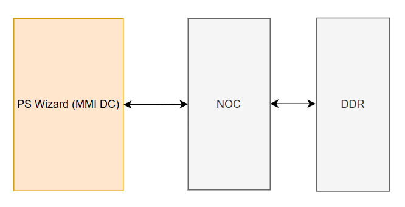 | 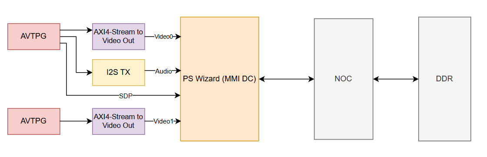 | 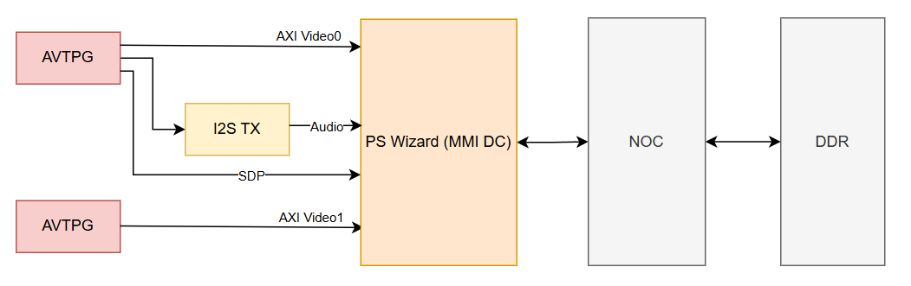 | 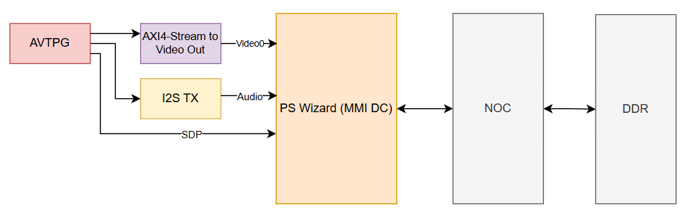 |

**DC Bypass modes**

| Bypass single (AVTPG) | Bypass MST 2 (AVTPG) | Bypass MST 4 (AVTPG) |
|---|---|---|
| 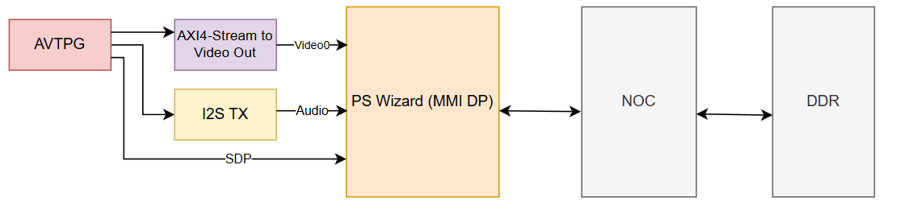 | 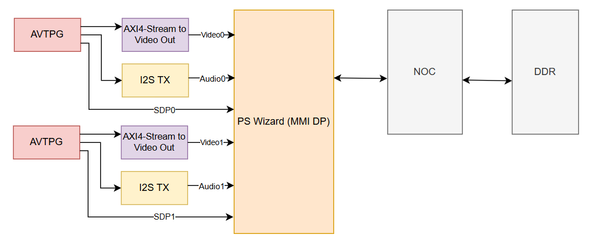 | 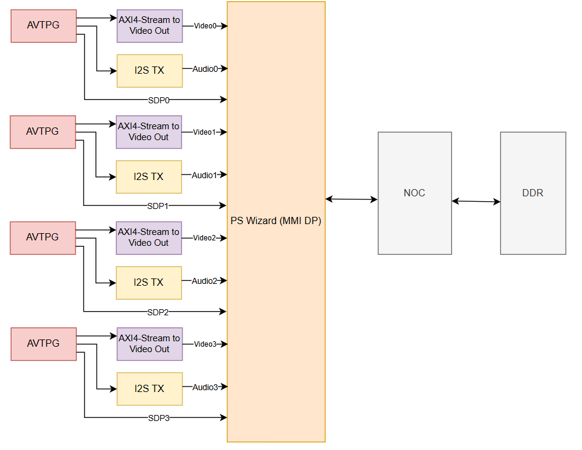 |

| Bypass single (DDR / SST) | Bypass hybrid (DDR + AVTPG / MST) |
|---|---|
| 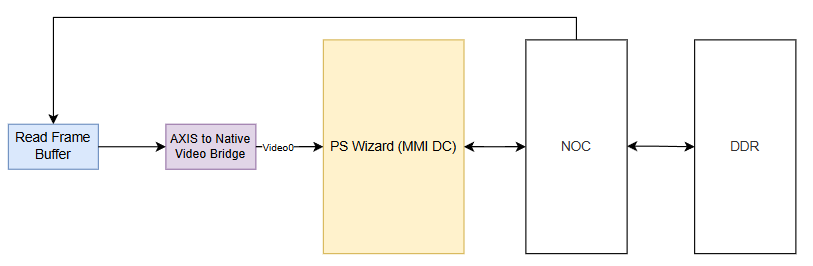 | 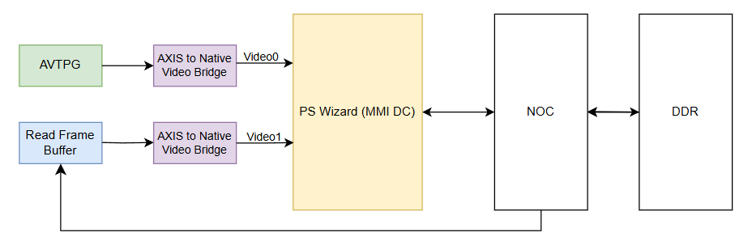 |

**USB 3.2**

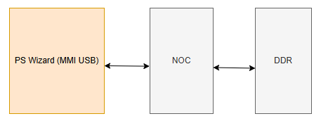

**Dual Display GPU (HDMI + DP)**

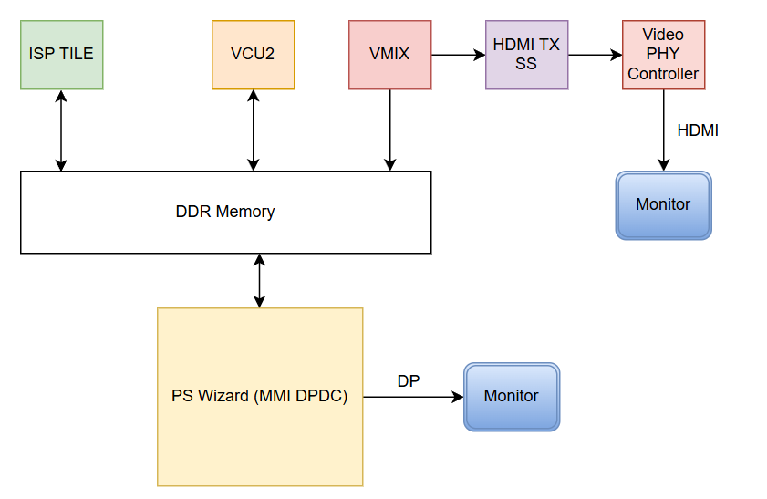

**High-level flow:**
- Video flows from the **source (AVTPG test-pattern generator or DDR frame buffer)** → **MMI Display Controller / DPDC** → **DisplayPort / HDMI output**
- Control and configuration are managed by the **Versal PS (PS Wizard)** with NoC-based interconnect
- Clocking and resets are driven from the PS Wizard MMI DC clocks and clock wizards

---

## Design Guidance

**General**
- Set DisplayPort lane count and presentation mode in the PS Wizard's DPDC Configuration pane (see **PG450 – Processing System Wizard**). Color depth, video format, and resolution/timing are set by your application to match your display and use case.
- If you change video format or audio rate while the system is running, always wait for the clock to report "locked" before releasing reset. Skipping this is the most common cause of unstable video.
- If you add your own logic to the design, connect it to the correct reset signal for its clock — video and audio have separate resets.

**Functional vs. Bypass**
- **Functional** (Non-Live / Live / Mixed) — blends two video layers into a single output.
- **Bypass** — each stream is an independent video path, with no blending. Supports single-stream (Quad/Dual/Single pixel-per-clock), 2-stream (Single/Dual pixel-per-clock), or 4-stream (single pixel-per-clock each) configurations.

**Which mode to pick**
- **Non-Live** — video frames are read from DDR memory instead of being generated in real time; use this when your application renders or stores frames in memory before displaying them.
- **Live (Native or AXI4-Stream)** — two Live video streams are blended together by the Display Controller (alpha blend, chroma-key, partial blend, or cursor blend) into a single output. Choose AXI4-Stream only if your other logic expects that specific interface.
- **Mixed** — one Live stream and one Non-Live stream, blended the same way as Live.
- **Bypass (test pattern, 1/2/4 streams)** — quick test-pattern generation, no memory involved.
- **Bypass (DDR, single-stream or 2-stream MST with DDR + AVTPG)** — single-stream reads one video stream from DDR. The 2-stream MST variant combines one DDR-sourced stream (carries audio) with one AVTPG-sourced stream (video only, no audio). This is also the easier starting point for higher resolutions or other pixel formats, since the DDR read path already supports them.
- **USB 3.2** — nothing USB-specific is configurable in this design; USB is configured in the same PS Wizard MMI Peripherals pane as DisplayPort (see PG450).
- **Dual Display GPU (HDMI + DisplayPort)** — the most demanding option; expect longer build/timing-closure times. The two boards (VEK385/VMK365) need different HDMI wiring setups, so don't reuse one board's setup on the other.

**Reference**
- **PG450 – Processing System Wizard** covers configuration of the MMI DisplayPort/DPDC and USB peripherals used by this design.

---

## Requirements

### Board Setup
- Devices: **AMD Versal™**
- Boards: **VEK385, VMK365**

---

## Getting Started

### Prerequisites
- **Vivado™ Design Suite:** 2026.2
- **Vitis™:** 2026.2 (for the bare-metal application build)
- **Yocto:** Linux build flow (for the Linux application build)
- Supported simulators: None (no simulation support)

### Generating the Example
1. In Vivado, select **File → Project → Open Example Project** (or **Create Project → Example**).
2. Choose **Versal MMI DPDC USB Designs** and the **VEK385** or **VMK365** board.
3. In the configuration wizard, select the **MMI Configuration** (`DC_Functional` / `DC_Bypass` / `USB` / `Dual_Display_GPU_(HDMI_and_DP)`) and the relevant sub-options:
   - **DPDC Presentation Mode** (Non_Live / Live / Mixed) — for `DC_Functional`
   - **Video Interface** (Native / `AXI4_Stream`) — for Live
   - **Stream Source** (AVTPG / DDR_(SST) / AVTPG_and_DDR_(MST)) — for `DC_Bypass`
   - **MST Enable** and **Number of Video Streams** (2 / 4) — for Bypass + AVTPG
4. Choose Finish to generate the block design.

**Expected outcome:**
The selected MMI block design is generated, validated, and a top-level HDL wrapper is created.

### Simulating the Example
Not applicable — this example design has no simulation support.

### Implementation Flow through PDI Generation
1. Run **Synthesis**.
2. Run **Implementation**.
3. Run **Write Device Image** to generate the PDI.

**Expected outcome:**
A device image (PDI) is produced. All designs are validated up to the `write_device_image` stage.

### Building Embedded Software Requirements

This design supports two embedded software flows: a **bare-metal** application (built with Vitis™) and a **Linux** application (built using the **Yocto** flow).

**Bare-metal (Vitis™):**
1. Export the hardware (XSA) from Vivado after generating the device image.
2. Create and build the standalone (bare-metal) application in Vitis using the exported XSA.

**Linux (Yocto):**
1. Set up the Yocto build environment and fetch the required layers for the target release.
2. Initialize the build environment.
3. Generate the hardware (XSA) from Vivado and produce the System Device Tree (SDT) from it.
4. Create a Yocto machine configuration from the generated device tree.
5. Build the boot image (`boot.bin`) and the Linux images (kernel, device tree, root filesystem).

**Expected outcome:**
The bare-metal application or the Linux boot image builds successfully and is ready to load onto the target.

### Running the Example in Hardware
1. Connect the **VEK385** or **VMK365** board and the relevant display(s) / USB peripheral(s).
2. Program the device image and load the software (bare-metal application or Linux boot image) onto the board over **JTAG**.
3. Run the bare-metal application, or boot Linux and run the application, to configure and drive the display pipeline.
4. Observe display output (or USB enumeration) for the selected configuration.

**Expected outcome:**
The configured display interface shows the test pattern / video output, or the USB interface enumerates.

---

## How to Explore or Extend This Design

Common next steps:
- Change the **MMI Configuration** or **DPDC Presentation Mode** in the wizard to explore other modes
- Switch the **video stream source** between AVTPG and DDR, or enable **MST** (2 / 4 streams)
- Replace the AVTPG test pattern with custom video logic

**Caution:**
Changes to the **NoC, PS Wizard, or DDR configuration** may require deeper Versal architecture knowledge.

---

## Validation and Known Limitations

**Validated with:**
- Tool versions: **Vivado 2026.2**
- Board revisions: **VEK385 RevA / RevB** (golden NoC compilation results provided for both), **VMK365**

**Known limitations:**
- No simulation support.
- Validated only up to `write_device_image`.

---

## What's Next?
- 🔗 Learn more: AMD Versal MMI Display Controller and USB Product Guides
- 🔗 Go deeper: Vivado™ Design Suite tutorials for Versal example designs
- 🔗 Related examples: Other AMD CED Store examples

---

## Support
This example design is provided as-is.
For questions, see **AMD Adaptive Support** or the related repository documentation.
