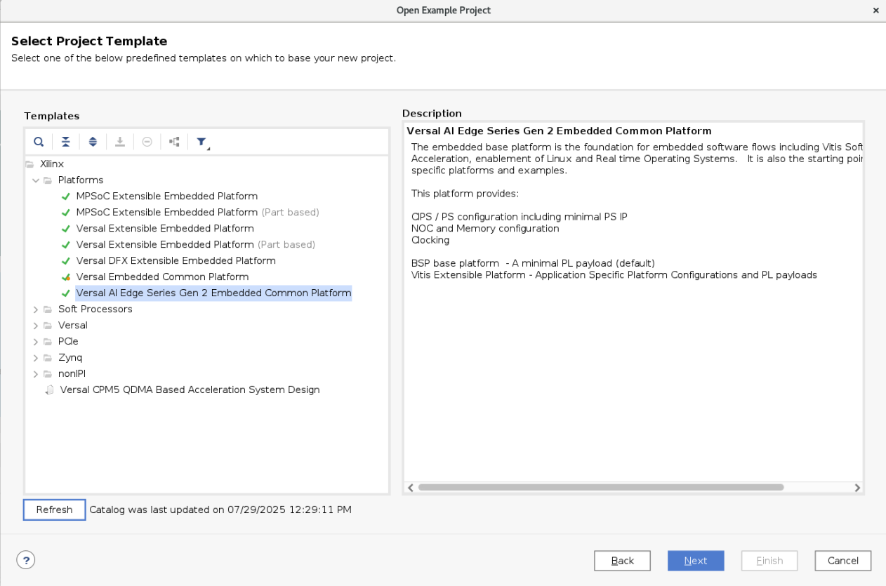
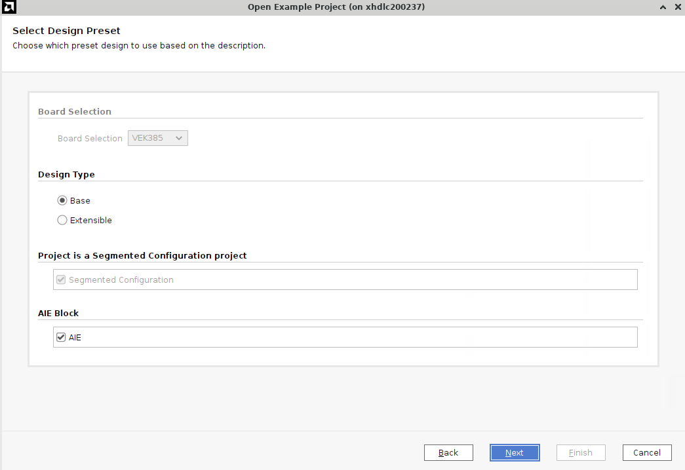
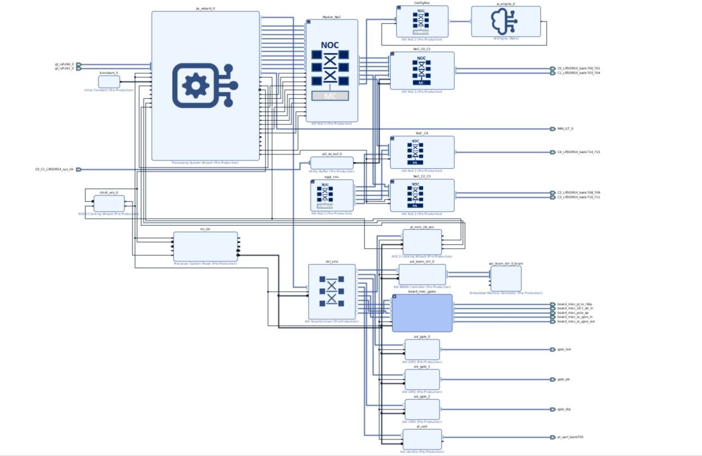
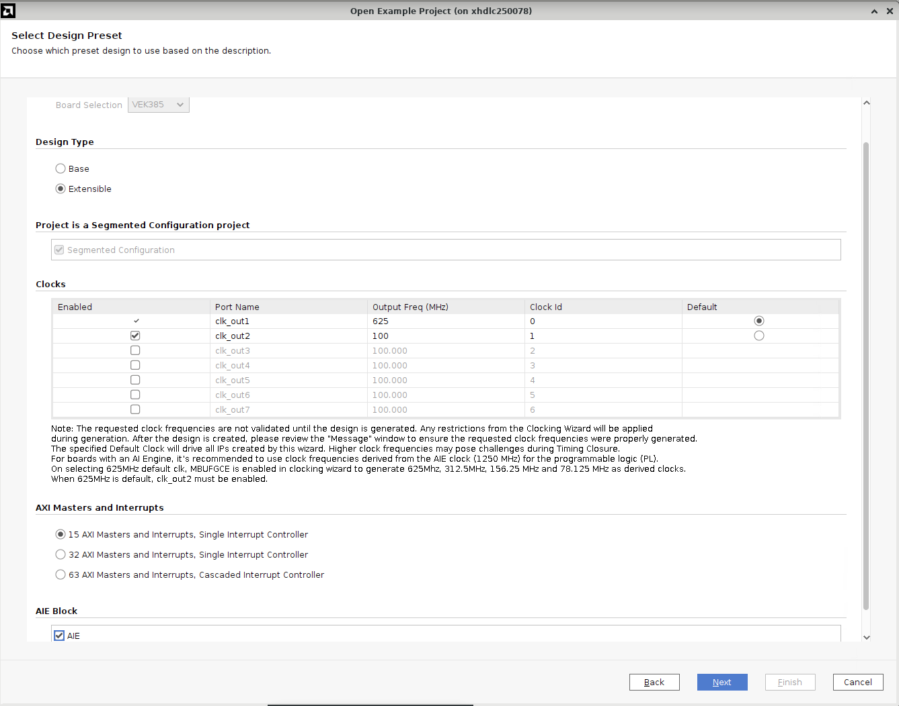
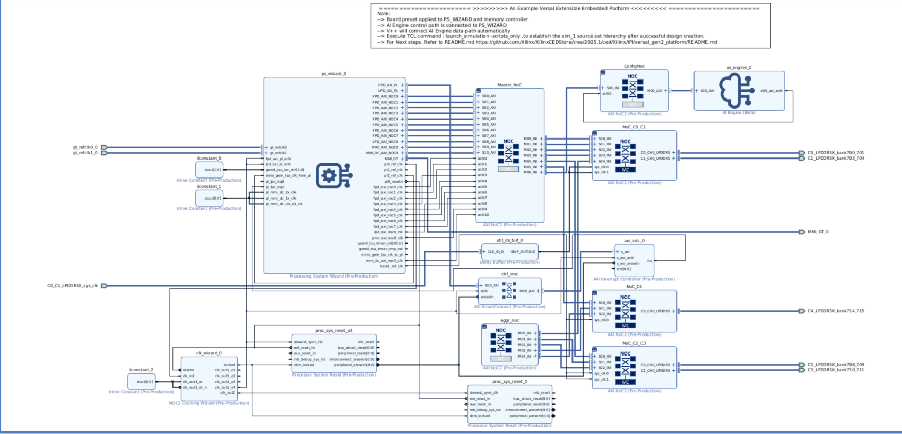
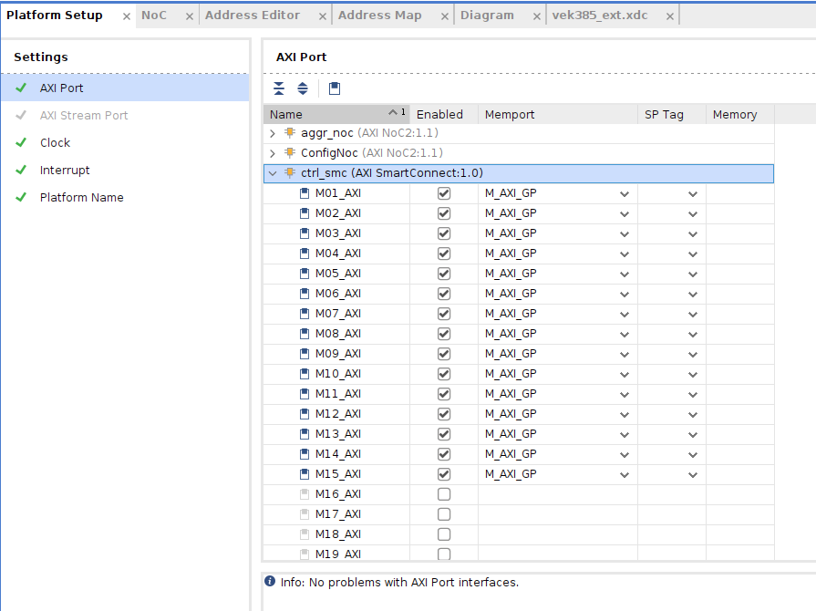
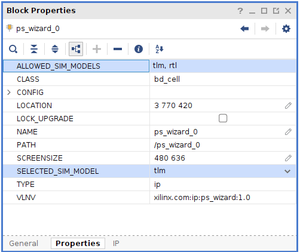

# Versal AI Edge Series Gen 2 Embedded Common Platform

## Table of Contents

- [Introduction](#introduction)
- [Hardware Platform Interfaces (Configuration)](#hardware-platform-interfaces-configuration)
- [Board Interfaces](#board-interfaces)
- [Usage Steps (How to Create a XSA)](#usage-steps-(how-to-generate-XSA))
    - [Step 1: Create the Vivado Project](#step-1-create-the-vivado-project)
    - [Step 2: Download Platform Example](#step-2-download-platform-example)
    - [Step 3: Create the Example Project](#step-3-create-the-example-project)
        - [Base Configuration (For SSW)](#base-configuration-for-ssw)
        - [Extensible Configuration (For Vitis)](#extensible-configuration-for-vitis)
    - [Step 4: Included Files (NCR and XDC)](#step-4-included-files-ncr-and-xdc)
    - [Step 5: Review the Platform Setup](#step-5-review-the-platform-setup)
    - [Step 6: Review Simulation Settings](#step-6-review-simulation-settings)
    - [Step 7: Generate Block Design](#step-7-generate-block-design)
    - [Step 8: Export Hardware XSA](#step-8-export-hardware-xsa)
-  [Validation](#validation)
- [Notes](#notes)
- [Known Issues](#known-issues)

## Introduction

The embedded base platform is the foundation for embedded software flows including Vitis Software Acceleration, enablement of Linux and Real Time Operating Systems. It is also the starting point for application specific platforms and examples. This pltform privides CIPS / PS configuration including minimal PS IP, NOC and Memory configuration,Clocking
This document describes the Base and user-customizable Extensible configurations for the AMD Versal™ Adaptive SoC Gen 2 AI Edge Series Embedded Common Platform targeting the VEK385 board (`xc2ve3858-ssva2112-2MP-e-S`), with pre-configured PS and NOC. The base platform enables System Software (SSW) development whereas Extensible platform targets Vitis development.

---
## Hardware Platform Interfaces (Configuration)
The table below lists different configurations supported for this Platform CED. Segmented configuration and AIE blocks are enabled by default for both base and extensible platforms. Whereas there are some additional clock and interrupts settings available only for extensible platform.


| Category              | Feature           | Default Configuration | Details                                                                                                                                                                                                 | Additional Info                                                                                   |
|-----------------------|-------------------|----------------------|--------------------------------------------------------------------------------------------------------------------------------------------------------------------------------------------------------|---------------------------------------------------------------------------------------------------|
|  | 
| Default Configuration (Common for both base and extensible) |    Segmented Configuration      |       Enabled               | Used to separate the system into logical partitions. | Improves modularity, supports partial reconfiguration, and reduces boot latency. Required for this platform.                                       |                                                                                                   |
|              | AIE Block           |  Enabled                    | AIE block is instantiated in both flows by default. | However, **AIE-based applications** are not validated on this platform. Disable AIE if targeting Linux/RTOS/baremetal applications.                     |                                                                     
| Extensible Parts    | Clock Settings | 625 MHz (clk_out1)   | Clocking Wizard uses AIE’s 1250 MHz reference to generate 625 MHz. Derived clocks: 312.5 MHz, 156.25 MHz, 78.125 MHz. | MBUFGCE enabled automatically. clk_out2 must be set. Frequencies are validated during design generation. Timing closure should be reviewed for higher frequencies. |
| | Interrupts |  15      | Three selectable configurations:<br>**15** – Single INTC, recommended for small designs.<br>**32** – Single INTC for mid-sized PL use.<br>**63** – Dual cascaded INTCs for large systems. | Only available in extensible configuration. Select based on number of PL accelerators and required interrupt capacity.                                                                                                  |

## Board Interfaces

You can access all the latest documentation at: [AMD Technical Information Portal](https://www.amd.com/en/support/technical-documentation.html)

To locate user guides relevant for this platform, search using the **product guide title** or **user guide number** on the site:

| Board Prefix                | User Manual / Guide | Description                                                        |
|-----------------------------|---------------------|--------------------------------------------------------------------|
| xc2ve3858-ssva2112-2MP-e-S  | PG432               | Versal AI Edge Series Gen 2 Image Signal Processor Product Guide   |
Alternatively, Please follow https://docs.amd.com/r/en-US/pg432-versal-ai-edge-series-gen-2-isp to access all Board Interface information for Versal AI Edge Series Gen 2.
## Usage steps (how to generate XSA)
### Step 1: Create the Vivado Project

1. Create a workspace folder and launch the AMD Vivado™ Design Suite by running the following commands in your terminal:


```sh
mkdir WorkSpacexc2ve3858-ssva2112-2MP-e-S
cd WorkSpace
source <Vivado_Install_Directory>/settings64.sh
```
Replace `<Vivado_Install_Directory>` with your Vivado installation path.

### Step 2: Download Platform Example

1. Open Vivado Store:

    - Navigate to **Tools → Vivado Store...**
    - Agree to download open-source examples.

2. Select and Download Platform:

    - Go to **Example Designs → Refresh → Platforms → Versal AI Edge Series Gen 2 Embedded Common Platform**
    - Click the **Download** button.

3. Close Vivado Store:

    - Once download and installation are complete, click **Close**.

### Step 3: Create the Example Project

1. Open Example:

    - Go to **File → Project → Open Example**
    - Click **Next**.

2. Select Project Template:

    - Choose **Versal AI Edge Series Gen 2 Embedded Common Platform**
    - Click **Next**.



3. Configure Project:

    - Set project name to `vek385_base`
    - Ensure the project location is inside your Workspace directory
    - Keep **Create project subdirectory** option checked
    - Click **Next**.

4. Select Default Part:

    - Select target part: `xc2ve3858-ssva2112-2MP-e-S` (VEK385 board)
    - Click **Next**.

    #### Base Configuration (For SSW)

    Base Configuration consists of PS configurations including minimal PS IP, NOC and Memory Configuration, Clocking and minimum PL payload like GPIO, PL UART, DIP Switches and miscellaneous Board based IO’s etc.

5. Configure Settings:

    - **Board Selection**: Keep default setting.
    - **Design Type**: Base
    - **Segmented Configuration**: **Enabled**
    - **Enable AIE**: Keep default setting.
    - Click **Next**.



6. Review and Finish:

    - Review the new project summary
    - Click **Finish**

    The generated design includes:

    - Processing System (PS) Wizard block
    - AXI NoC block
    - AI Engine
    - Supporting logic blocks

    

> **Note:** The Base configuration includes a validated block design, wrapper file, and board-specific constraints.

---

#### Extensible Configuration (For Vitis)

Extensible Configurations consist of PS configurations including minimal PS IP, NOC and Memory Configuration, Clocking, PL payloads along with Interrupt Controllers, proc system resets and fixed clocks based on which Vitis can derive other required clock and hook kernels to that clock.

#### Step 3: Create the Example Project

Follow points 1 to 4 outlined in Step 3 above to create a new project and continue on with the steps mentioned below:

1. Configure Settings:
    - **Board Selection**: Always use **VEK385** or `xc2ve3858-ssva2112-2MP-e-S`
    - **Design Type**: Extensible
    - **Segmented Configuration**: Keep default setting.
    - **Clock Settings**: Keep default settings. Please refer to the notes in the CED wizard to know more about clocks.
    - **Interrupt Settings**: Keep default setting (15 interrupts mode).
    - **Enable AIE**: Disable if building Linux/RTOS or acceleration apps
2. Click **Next**.



3. Review and Finish:

    - Review the new project summary
    - Click **Finish**

    The generated design includes the following components:

    - Processing System (PS) Wizard block
    - AXI NoC block
    - AI Engine
    - Supporting logic blocks

    

---

### Step 4: Included Files (NCR and XDC)

- The constraint file `vek385_ext.xdc` is already included in the project by default.
- NCR file `vek385_6140274_0xe2261acc.ncr` is provided in the utility sources. This file is associated with default Implementation run and thus is provided as part of NOC_SOLUTION_FILE. It is provided for both Base and Extensible platforms.
- This NCR file ensures that both base and extensible designs are compatible with each other, thus boot PDI of base design and boot PDI of extensible design will be compatible.

---

### Step 5: Review the Platform Setup

1. (Optional) Export the Block Design as a TCL Script:

    - Go to **File → Export → Export Block Design**
    - Note the location of the exported TCL file, then click **OK**
    - Open the TCL file to review or reuse the design setup

2. Open the Platform Setup Tab:

    - Navigate to the Platform Setup tab to configure or verify platform-specific settings.
    - If the tab is not visible, go to **Window → Platform Setup** to open it.

        > **NOTE:** If you cannot find the Platform Setup tab, ensure the project is configured as an extensible Vitis platform:
        >
        > - Open **Settings** from the Project Manager.
        > - Go to **Project Settings → General**.
        > - Make sure **Project is an extensible Vitis platform** is enabled.

3. Review AXI Port Settings

- **AXI Port Settings Based on Interrupt Configuration**

    - **For 15 Interrupts:**
        - `ctrl_smc`
            - AXI interfaces: `M01_AXI` to `M15_AXI`
            - Memport: `M_AXI_GP`
            - SP Tag: (empty)

    - **For 32 Interrupts:**
        - `ctrl_smc`
            - AXI interfaces: `M03_AXI` to `M04_AXI`
        - `icn_ctrl_0`
            - AXI interfaces: `M01_AXI` to `M15_AXI`
        - `icn_ctrl_1`
            - AXI interfaces: `M01_AXI` to `M15_AXI`
        - Memport: `M_AXI_GP`
        - SP Tag: (empty)

    - **For 63 Interrupts:**
        - `ctrl_smc`
            - AXI interfaces: `M06_AXI` to `M08_AXI`
        - `icn_ctrl_0` to `icn_ctrl_3`
            - AXI interfaces: `M01_AXI` to `M15_AXI`
        - Memport: `M_AXI_GP`
        - SP Tag: (empty)



4. Review the clock and interrupt settings.

    - Ensure the derived clocks, interrupt mapping, and AXI connectivity align with your configuration.

---

### Step 6: Review Simulation Settings

- Ensure that the simulation model is set to TLM for CIPS, NOC, and AI Engine blocks.



*For more information on Simulation and their usage, refer to the Logic Simulation (UG900)*.

---

### Step 7: Generate Block Design

- Select **Generate Block Design** from Flow Navigator.
- Set Synthesis Options to **Global**. It will skip IP synthesis during generation.
- Click **Generate**.

---

### Step 8: Export Hardware XSA

1. Export the Hardware Platform:

    - Click **File → Export → Export Platform**
    - Or use the Flow Navigator window: **IP Integrator → Export Platform**
    - Or click the **Export Platform** button on the bottom of the **Platform Setup** tab.

2. Configure Export Settings:

    - Click **Next** on the Export Hardware Platform page.
    - Select **Hardware**.
    - Select **Pre-synthesis**.
    - Keep the default settings in the Platform Properties setup dialog.
    - Enter the XSA file name: `versal_gen2_platform_wrapper_hw`
    - Click **Next**, review the summary, and click **Finish**.

    The file `versal_gen2_platform_wrapper_hw.xsa` will be generated in the `vek385_extensible` directory.

3. Export Hardware Emulation XSA

    Repeat the same steps above, but:

    - Select **Hardware Emulation** instead of Hardware.
    - Set XSA file name to: `versal_gen2_platform_wrapper_hwemu`

    The file `versal_gen2_platform_wrapper_hwemu.xsa` will be generated in the `vek385_extensible` directory.

---
## Validation

Valdiation examples for the designs generated above can be found on https://github.com/Xilinx/Vitis-Tutorials. Users can utilize these tutorials for AI Engine development, Hardware Acceleration, Vitis Platform creation etc.
## Notes

This common platform is a segmented configuration design which includes boot and PL PDI’s for respective configurations. Any modification made to these PDI’s is not guaranteed to work. Please refer to [Vivado-Design-Tutorials/Versal/Boot_and_Config/Segmented_Configuration at 2025.1 · Xilinx/Vivado-Design-Tutorials](https://github.com/Xilinx/Vivado-Design-Tutorials/tree/2025.1/Versal/Boot_and_Config/Segmented_Configuration#segmented-configuration-tool-flow-in-vivado) before making any changes in the platform design.

Any customizations made to the design are not guaranteed to work or meet timings.

For detailed information and advanced configurations, refer to the official AMD documentation and user guides.

---

## Known Issues

In Versal, the DDRMC5 uses the CLKOUTPHY and CLKOUTPHY_90 ports of the X5PLL but in 2025.1 and 2025.1.1 release there is a Known Issue where a Pulse Width check is flagging erroneously for the CLKOUTPHY_90 port. Please refer to AR 000038076.