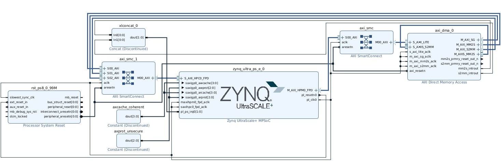
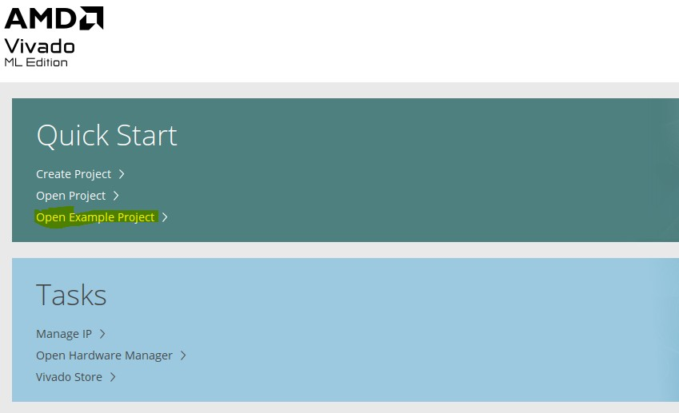
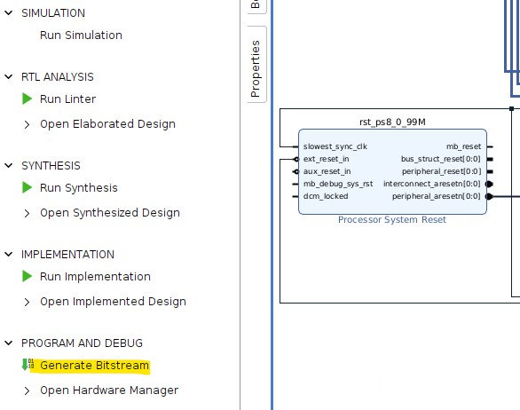
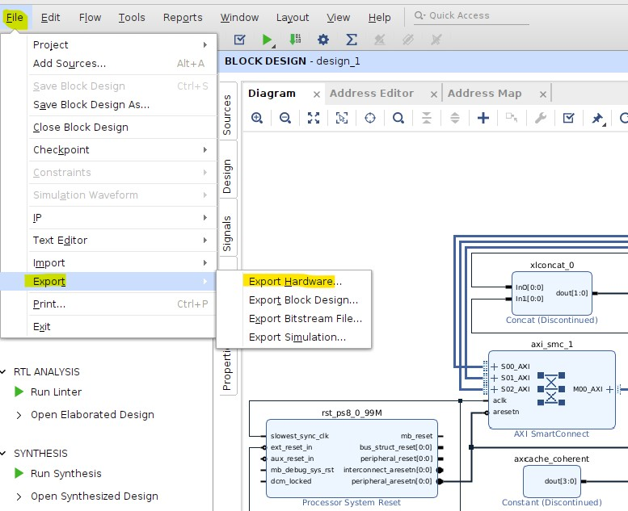
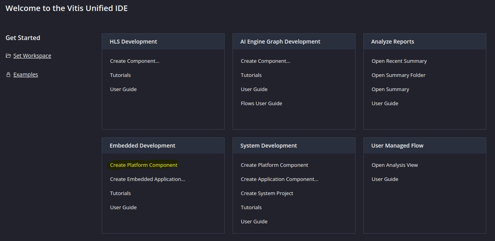
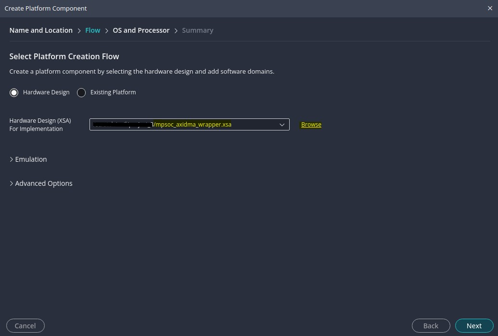
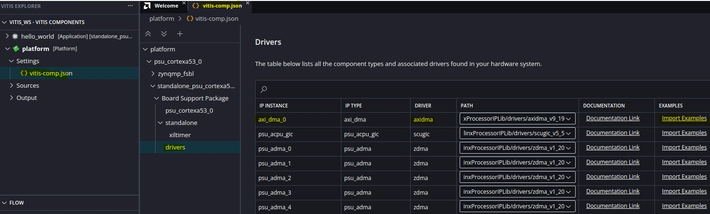
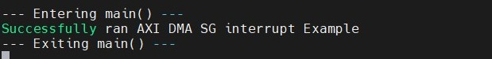

# ZynqMP Example Design : AXI DMA
## Objective
This ZynqMP example design demonstrates how to run the AXI DMA standalone application on the ZCU102 board. It showcases the functionality of the AXI DMA standalone driver, which is included in the Xilinx Vivado and Vitis toolchains.

## Required Hardware and Tools

Software: Xilinx Vivado and Vitis 2025.1

Hardware: ZCU102 Evaluation Board

Boot Mode: JTAG

## Block Diagram

## Vivado Design Steps

#### 1. Launch Vivado and select "Open Example Project".

#### 2. Choose "Zynq UltraScale+ MPSoC Design – AXI DMA".

#### 3. Generate the bitstream (.bit) and hardware description (.xsa) by selecting "Generate Bitstream" and "Export Hardware".

## Vitis Steps

#### 1. Launch Vitis and create a new platform project.

#### 2. Browse and select the .xsa file exported from Vivado, then click Next. 

#### 3. Import the AXI DMA SG Interrupt Application Example using the vitis-comp.json file and build the project.

#### 4 Build the imported AXI DMA project and run the application on the ZCU102 board.

#### 5 Console Output:

