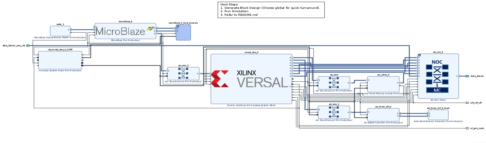
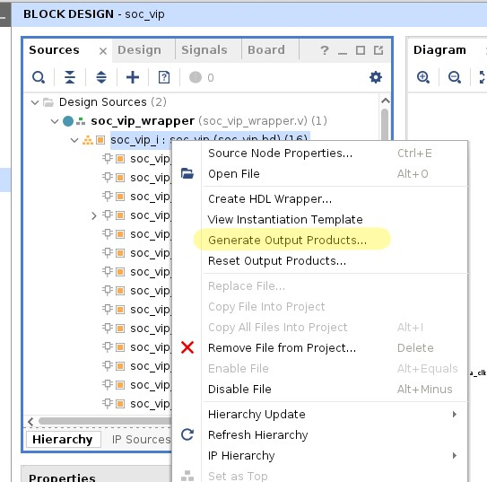
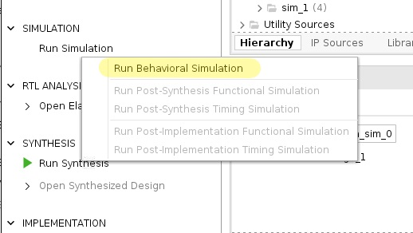

CIPS VIP Example Design

Objective
This example design demonstrates how to use the CIPs VIP to send and receive AXI and NoC traffic in a Versal design.

The CIPs VIP documentation is available on the lounge at https://www.xilinx.com/member/versal-cips-vip-ea.html.

Refer to AR# 75889 for CIPS VIP release notes and known issues. https://www.xilinx.com/support/answers/75889.html

Required Hardware and Tools
2024.1 Vivado
No hardware is required.

## Block Diagram

Running the Simulation
1. IP output products are not included as part of the example design and need to be generated. Generate output products for the block design. Select global for a quick turnaround and then run the simulation

## Output Products

2. Run the simulation.

## Behaviorial Simulatio

3. A successful run completes with the following messages.

INFO: [VERSAL_CIPS_PS_VIP] (tb.DUT.soc_vip_wrapper_i.soc_vip_i.versal_cips_0.inst.PS9_VIP_inst.inst.read_burst) :: [read_burst] [83044] ::: [R5_API] AXI Read with Starting Address(0x10001fc0) is initiated

INFO: [VERSAL_CIPS_PS_VIP] (tb.DUT.soc_vip_wrapper_i.soc_vip_i.versal_cips_0.inst.PS9_VIP_inst.inst.read_burst) :: [read_burst] [83170] ::: [R5_API] Done AXI Read with Starting Address(0x10001fc0) with Response 'OKAY'

CDMA data compare PASS

Testbench complete

trace_performance.txt has been created for both NA and DC!

trace_performance.txt has been created for both NA and DC!

trace_performance.txt has been created for both NA and DC!

trace_performance.txt has been created for both NA and DC!

ADEC checks are passing!

Executing Axi4 End Of Simulation checks

Executing Axi4 End Of Simulation checks

Executing Axi4 End Of Simulation checks

Executing Axi4 End Of Simulation checks

Executing Axi4 End Of Simulation checks

Executing Axi4 End Of Simulation checks

Executing Axi4 End Of Simulation checks

$finish called at time : 83169732 ps : File "/project_1/project_1.srcs/sim_1/imports/soc_vip/system.sv" Line 176

run: Time (s): cpu = 00:02:08 ; elapsed = 00:03:30 . Memory (MB): peak = 11352.809 ; gain = 124.215 ; free physical = 414206 ; free virtual = 470358

4. There is a known issue in 2021.1 with NoC simulation where the sim_wrapper is not always generated with a port list. Refer to AR# 76085 for details. https://www.xilinx.com/support/answers/76085.html