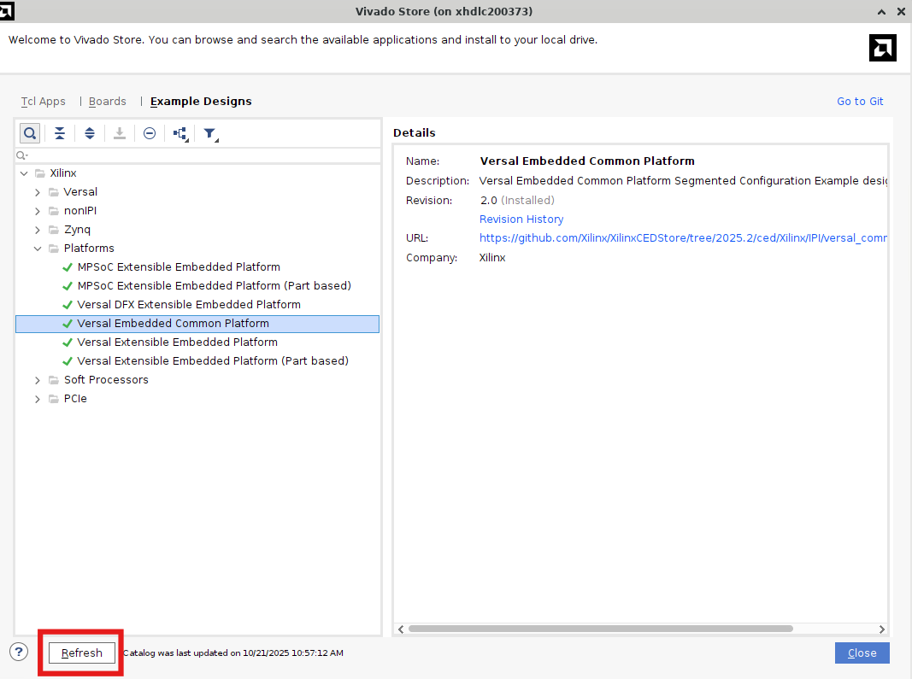
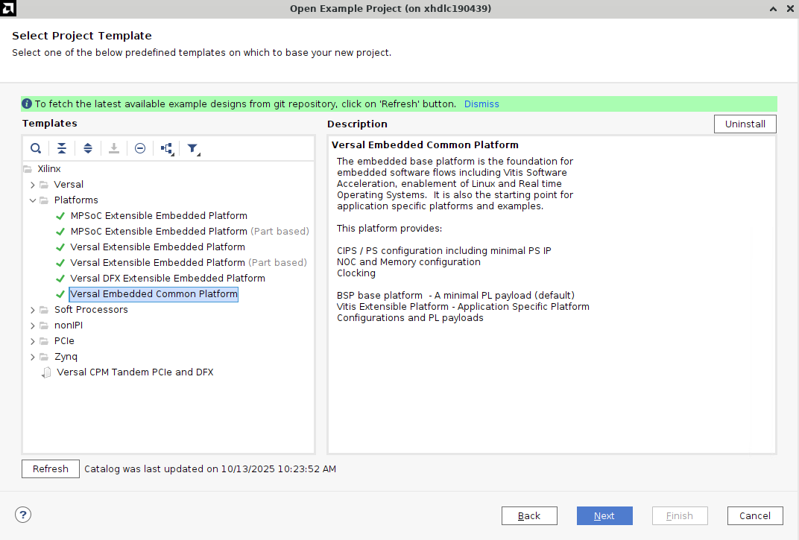
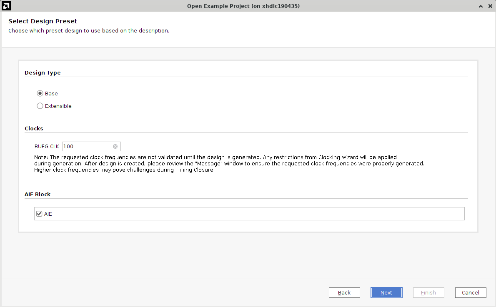
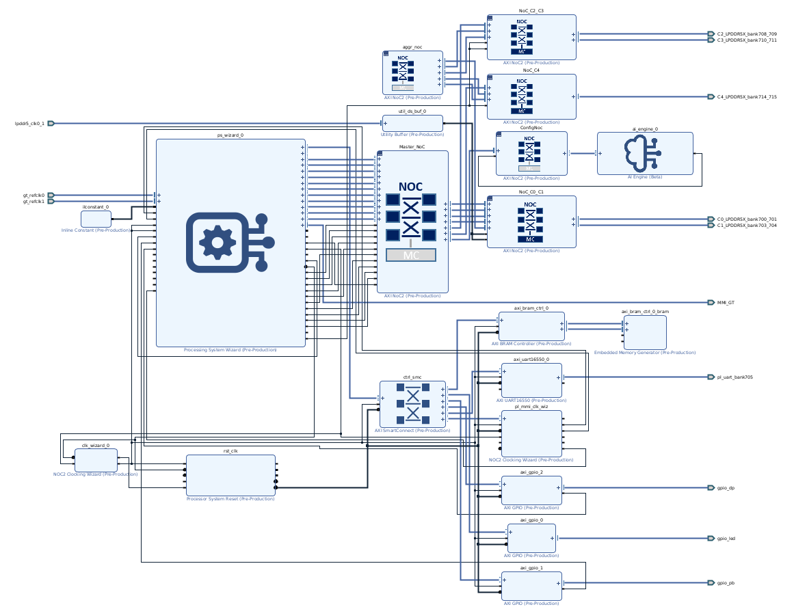
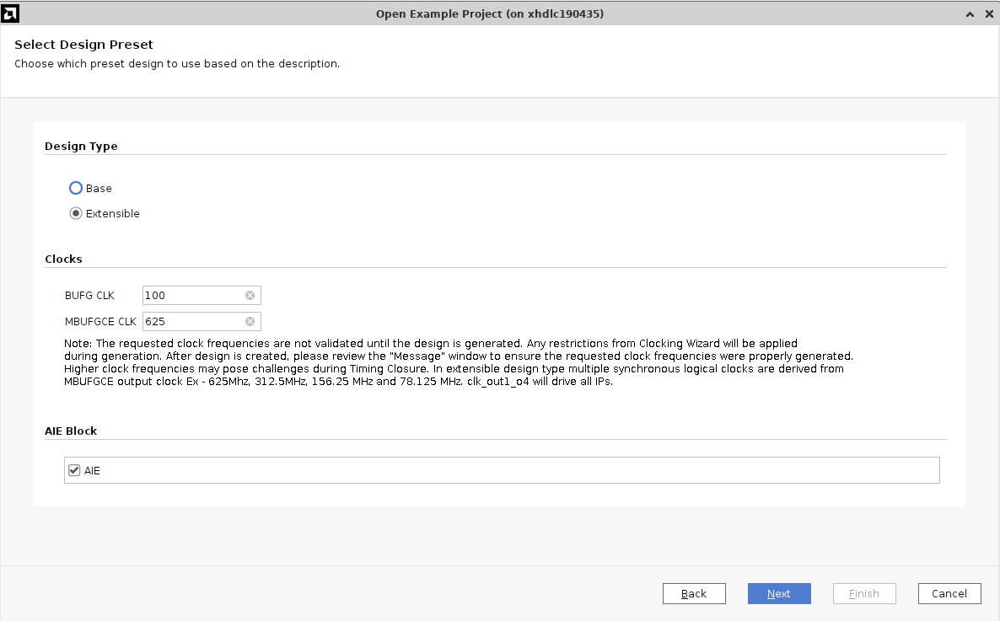
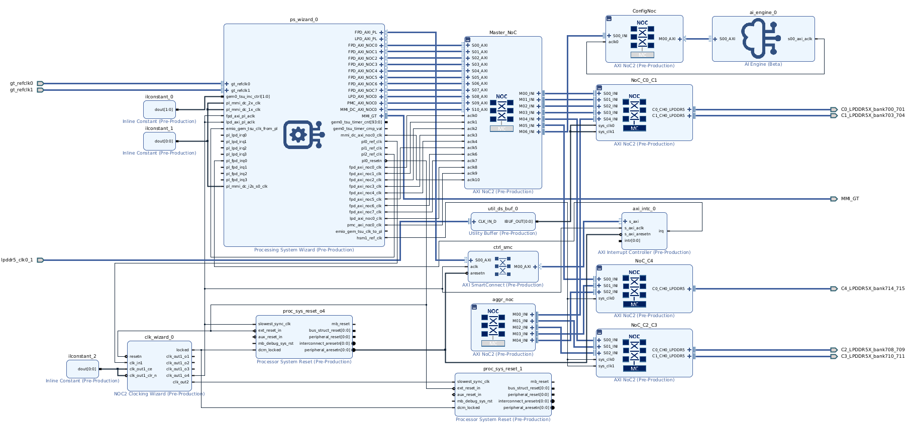
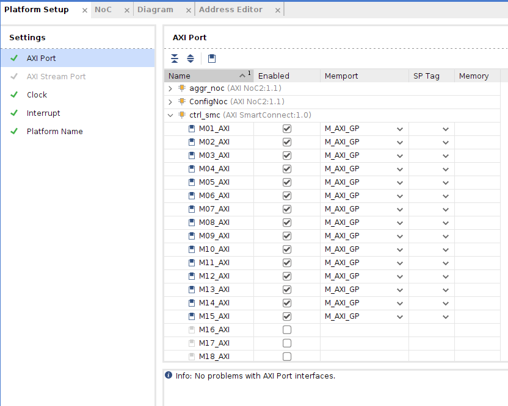
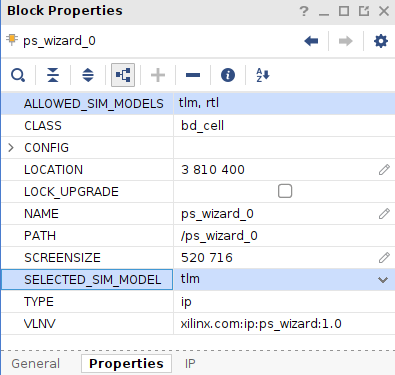

## Table of Contents

- [Introduction](#introduction)
- [Hardware Platform Interfaces (Configuration)](#hardware-platform-interfaces-configuration)
- [Board Interfaces](#board-interfaces)
- [Steps to Create a XSA file](#steps-to-create-a-xsa-file)
    - [Step 1: Create the Vivado Project](#step-1-create-the-vivado-project)
    - [Step 2: Create the Example Project](#step-2-create-the-example-project)
        - [Base Configuration (For SSW)](#base-configuration-for-ssw)
        - [Extensible Configuration (For Vitis)](#extensible-configuration-for-vitis)
    - [Step 3: Included File (NCR)](#step-3-included-file-ncr)
    - [Step 4: Review the Platform Setup](#step-4-review-the-platform-setup)
    - [Step 5: Review Simulation Settings](#step-5-review-simulation-settings)
    - [Step 6: Generate Block Design](#step-6-generate-block-design)
    - [Step 7: Export Hardware XSA](#step-7-export-hardware-xsa)
- [Validation](#validation)
- [Notes](#notes)

## Introduction

The embedded base platform is the foundation for embedded software flows including Vitis Software Acceleration, enablement of Linux and Real-Time Operating Systems. It is also the starting point for application-specific platforms and examples. This platform provides CIPS / PS configuration including minimal PS IP, clocking, NOC, and memory configuration.

This document describes the Base and user-customizable Extensible configurations for the AMD Versal Embedded Common Platform targeting multiple boards including VEK385, VEK280, VCK190, and VRK160. It features pre-configured PS and NOC settings. The base platform enables System Software (SSW) development, whereas the Extensible platform targets Vitis development.

---
## Hardware Platform Interfaces (Configuration)

The table below lists different configurations supported for this Platform CED. Segmented configuration and AIE blocks are enabled by default for both base and extensible platforms. Additional clock and interrupt settings are available only in the extensible configuration.

| Category              | Feature           | Default Configuration | Details                                                                                                                                                                                                 | Additional Info                                                                                   |
|-----------------------|-------------------|----------------------|--------------------------------------------------------------------------------------------------------------------------------------------------------------------------------------------------------|---------------------------------------------------------------------------------------------------|
| Default Configuration<br>(Common for both base and extensible)  | AIE Block           |  Enabled                    | AIE block is instantiated in both flows by default. | However, **AIE-based applications** are not validated on this platform. Disable AIE if targeting Linux/RTOS/baremetal applications.                     |
|   | Clock Settings    | Base design: BUFG (100 MHz)<br>Extensible design: MBUFGCE (625 MHz) + BUFG (100 MHz)   | In extensible design, multiple synchronous logical clocks are derived from MBUFGCE output clock: 625 MHz, 312.5 MHz, 156.25 MHz, and 78.125 MHz, clk_out1_o4 will drive all IPs. | Frequencies are validated during design generation. Timing closure should be reviewed for higher frequencies. |

> **Note:** Segmented Configuration is enabled by default for both base and extensible configurations, and no user action is required.

## Board Interfaces

You can access all the latest documentation at: [AMD Technical Information Portal](https://docs.amd.com/)

To locate user guides relevant to this platform, search using the **product guide title** or **user guide number** on the site:

| Board Prefix                | User Manual / Guide | Description                                                        |
|-----------------------------|---------------------|--------------------------------------------------------------------|
| VCK190 Evaluation Platform  | UG1366               | VCK190 Evaluation Board User Guide   |
| VEK280 Evaluation Platform  | UG1612               | VEK280 Evaluation Board User Guide   |
| VEK385 Evaluation Platform  | PG432               | Versal AI Edge Series Gen 2 Image Signal Processor Product Guide   |
| VRK160 Evaluation Platform  | N/A               | -   |

---

## Steps to Create a XSA file


### Step 1: Create the Vivado Project

1. Create a workspace folder and launch the AMD Vivado™ Design Suite by running the following commands in your terminal:


```sh
mkdir WorkSpace #create workspace
cd WorkSpace
source <Vivado_Install_Directory>/settings64.sh
```
Replace `<Vivado_Install_Directory>` with your Vivado installation path.

2. On the Vivado **Home Page**, go to **Tools** -> **Vivado Store**. Click **OK** to download open source examples from web. Select **Example Designs** -> Platform -> **Versal Embedded Common Platform**, and click the download button on the tool bar.
Click **Close** after the installation is complete.

> **Note:** This step is needed only for first time usage. Click **Refresh** to get updated CED's for subsequent usage.



---

### Step 2: Create the Example Project

1. Open Example:

    - Go to **File → Project → Open Example**.
    - Click **Next**.

2. Select Project Template:

    - Choose **Versal Embedded Common Platform**.
    - Click **Next**.

    

3. Configure Project:
    - Set project name to `vek385_base`(VEK385 board has been selected for this tutorial).
    - Ensure the project location is inside your Workspace directory.
    - Keep **Create project subdirectory** option checked.
    - Click **Next**.

4. Select Default Part:

    - Select target part: `VEK385 Evaluation Platform`.
    - Click **Next**.

    #### Base Configuration (For SSW)

    Base Configuration consists of PS configurations including minimal PS IP, NOC and Memory Configuration, Clocking and minimum PL payload like GPIO, PL UART, DIP Switches and miscellaneous Board based IO’s etc.

5. Configure Settings:

    - **Design Type**: Base.
    - **Enable AIE**: Keep default setting.
    - Click **Next**.

    

6. Review and Finish:

    - Review the new project summary
    - Click **Finish**

    The generated design includes:

    - Processing System (PS) Wizard block
    - AXI NoC block
    - AI Engine
    - Supporting logic blocks

    

    > **Note:** The Base configuration includes a validated block design and a wrapper file.

    #### Extensible Configuration (For Vitis)
    
    Extensible Configurations consist of PS configurations including minimal PS IP, NOC and Memory Configuration, Clocking, PL payloads along with Interrupt Controllers, proc system resets and fixed clocks based on which Vitis can derive other required clock and hook kernels to that clock.

    Follow points 1 to 4 outlined in Step 2 above to create a new project and continue on with the steps mentioned below:
    1. Configure Settings:
        - **Design Type**: Extensible
        - **Clock Settings**: Keep default settings. Please refer to the notes in the CED wizard to know more about clocks.
        - **Enable AIE**: Disable if building Linux/RTOS or acceleration apps
    2. Click **Next**.

    

    3. Review and Finish:

        - Review the new project summary
        - Click **Finish**

        The generated design includes the following components:

        - Processing System (PS) Wizard block
        - AXI NoC block
        - AI Engine
        - Supporting logic blocks

    

---

### Step 3: Included File (NCR)

NCR file `vek385_reva_6223262_0xc546f4d8.ncr` is provided in the utility sources. This file is associated with default Implementation run and thus is provided as part of NOC_SOLUTION_FILE. It is provided for both Base and Extensible platforms.<br>
This NCR file ensures that both base and extensible designs are compatible with each other, thus boot PDI of both configurations will be compatible.

---

### Step 4: Review the Platform Setup

1. (Optional) Export the Block Design as a TCL Script:

    - Go to **File → Export → Export Block Design**
    - Note the location of the exported TCL file, then click **OK**
    - Open the TCL file to review or reuse the design setup

2. Open the Platform Setup Tab:

    - Navigate to the Platform Setup tab to configure or verify platform-specific settings.
    - If the tab is not visible, go to **Window → Platform Setup** to open it.

        > **NOTE:** If you cannot find the Platform Setup tab, ensure the project is configured as an extensible Vitis platform:
        >
        > - Open **Settings** from the Project Manager.
        > - Go to **Project Settings → General**.
        > - Make sure **Project is an extensible Vitis platform** is enabled.

3. Review AXI Port Settings

- **AXI Port Settings Based on Interrupt Configuration**

    - **For 15 Interrupts:**
        - `ctrl_smc`
            - AXI interfaces: `M01_AXI` to `M15_AXI`
            - Memport: `M_AXI_GP`
            - SP Tag: (empty)


    
    > **Note:** The platform Setup tab shows 15 interrupts by default. For designs requiring more than 15 interrupts (e.g., 32 or 63), use the VPL flow to manually add the required interfaces.

4. Review the clock and interrupt settings.

    - Ensure the derived clocks, interrupt mapping, and AXI connectivity align with your configuration.

---

### Step 5: Review Simulation Settings

- Ensure that the simulation model is set to TLM for CIPS, NOC, and AI Engine blocks.



*For more information on Simulation and their usage, see Vivado Design Suite User Guide: Logic Simulation (UG900).*

---

### Step 6: Generate Block Design

- Select **Generate Block Design** from Flow Navigator.
- Set Synthesis Options to **Global**. It will skip IP synthesis during generation.
- Click **Generate**.

---

### Step 7: Export Hardware XSA

1. Export the Hardware Platform:

    - Click **File → Export → Export Platform**
    - Or use the Flow Navigator window: **IP Integrator → Export Platform**
    - Or click the **Export Platform** button on the bottom of the **Platform Setup** tab.

2. Configure Export Settings:

    - Click **Next** on the Export Hardware Platform page.
    - Select **Hardware**.
    - Select **Pre-synthesis**.
    - Keep the default settings in the Platform Properties setup dialog.
    - Enter the XSA file name: `versal_comn_platform_wrapper_hw`
    - Click **Next**, review the summary, and click **Finish**.

    The file `versal_comn_platform_wrapper_hw.xsa` will be generated in the `vek385_extensible` directory.

3. Export Hardware Emulation XSA

    Repeat the same steps above, but:

    - Select **Hardware Emulation** instead of Hardware.
    - Set XSA file name to: `versal_comn_platform_wrapper_hwemu`

    The file `versal_comn_platform_wrapper_hwemu.xsa` will be generated in the `vek385_extensible` directory.

---

## Validation

Valdiation examples for the designs generated above can be found on [GitHub - Xilinx/Vitis-Tutorials: Vitis In-Depth Tutorials](https://github.com/Xilinx/Vitis-Tutorials). You can use these tutorials for AI Engine development, Hardware Acceleration, Vitis Platform creation, etc.


## Notes

This common platform uses a segmented configuration design that includes boot and PL PDI files for respective configurations. Any modification to these PDIs is not guaranteed to work. Please refer to [GitHub - Xilinx/Vivado-Design-Tutorials](https://github.com/Xilinx/Vivado-Design-Tutorials/) `Versal/Boot_and_Config/Segmented_Configuration` for guidance before making changes to the platform design.

Any customizations made to the design are not guaranteed to work or meet timings.

For detailed information and advanced configurations, refer to the official AMD documentation and user guides.

---
