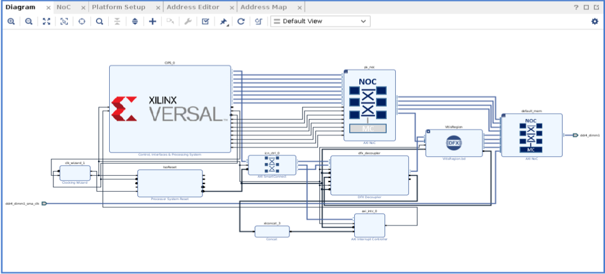
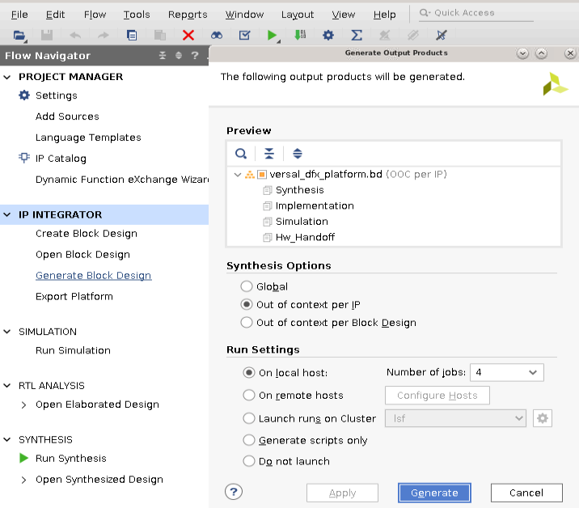
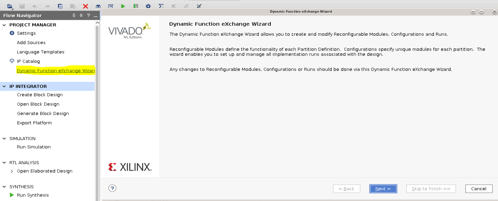
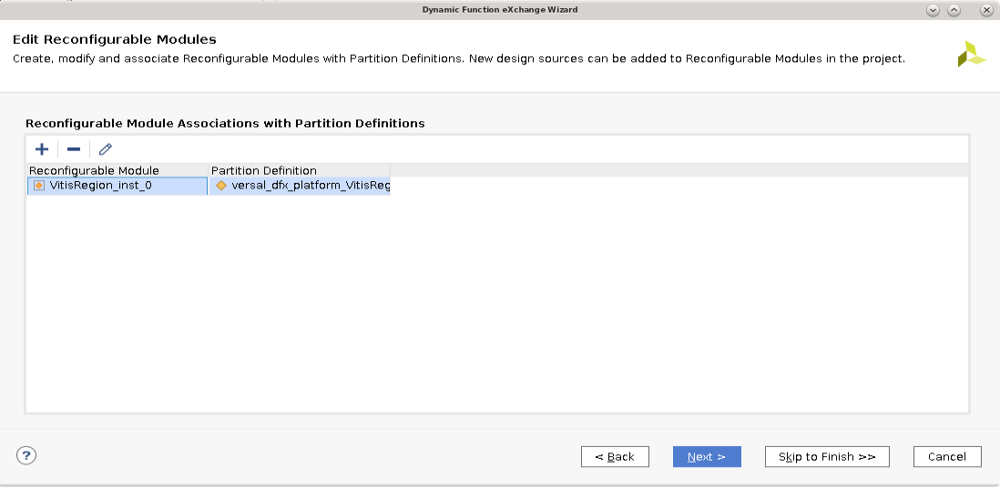
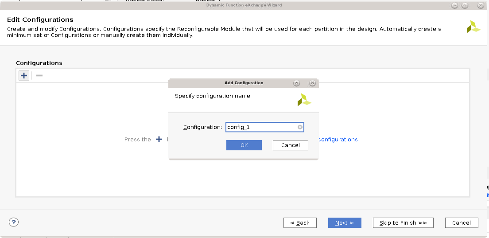
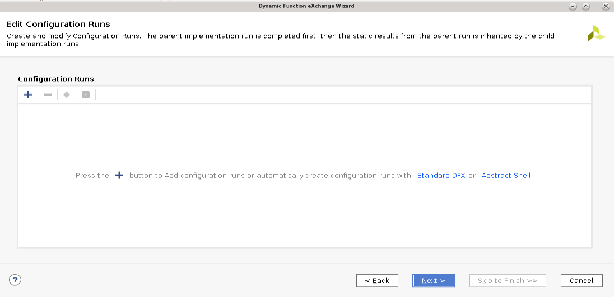
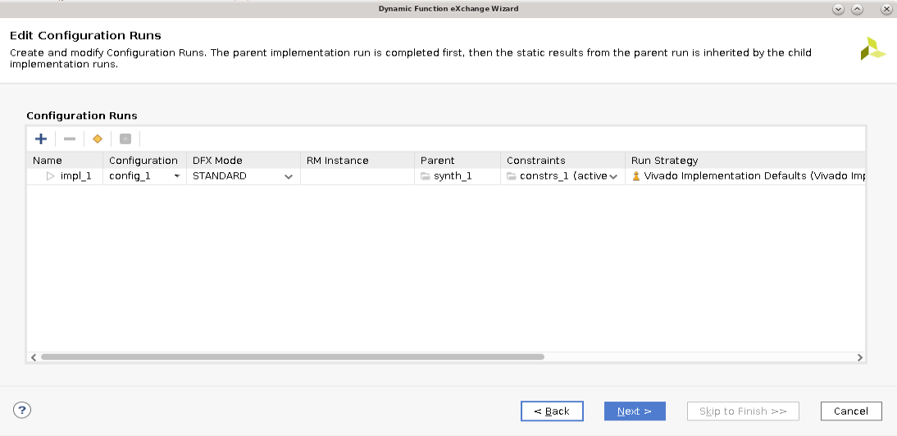

Versal DFX Platform Design

Objective:

This example design demonstrates how to use the Dynamic Function eXchange feature with a Versal design. Users can switch xclbin (acceleration kernel container for AI Engine and PL) without rebooting the system.

This design comes with common hardware features on the VCK190 board like AI Engine, GEM, DDR and LPDDR. It is useful as a base platform for exercising Vitis capabilities and topologies on the VCK190 board.

Required Hardware and Tools:

2023.2 Vivado

Versal AI Core Series VCK190 Evaluation Kit is required.

## Block Diagram

This Example design contains a top BD (versal_dfx_platform.bd) and a DFX BD(VitisRegion). What ever the Configurations selected in GUI will be added to VitisRegion.bd with Dynamic Function eXchange feature and boundary constraints. 
  
Note: Block Diagram will vary according to GUI options selected.
      User can skip from step-1 to step-8 as these are covered in default CED flow until unless, wants to modify the design by adding another RP or RM, launching DFX wizard to modify the configuartion runs etc.    
	  
Running the DFX Flow
1. Generate output products for the block design. Select global for a quick turnaround.

## Output Products

2. Setup Dynamic Function Exchange (DFX) configurations:.

 This step is essential because you want to associate your Partition Definitions to certain configurations. This allows your Reconfigurable Modules (RMs) to synthesize differently than other Block Designs (BDs).

Click on 'Dynamic Function eXchange Wizard' in the Flow Navigator. Click Next
## Enable Dynamic Function eXchange Wizard

3.	This window shows you a list of Partition Definitions in your design and RMs inside of them. Seletct VitisRegion_inst_0 RM and click Next.
## Edit Reconfigurable Modules

4.	This window allows you to create custom configurations to you RMs. Click on + it 'automatically create configurations' → Next.
## Edit Configurations

5.	This window allows you to attach custom configurations to you RMs. Select "config_1' Click on Next.
## Select Configurations

6.	This window allows you to create custom runs to your RMs. Select Standard DFX, this 'automatically create configuration run'.
## Configuration Runs

7.	The next window allows you to attach custom runs to your RMs. Click on → Next.
## Add Configuration Runs

8.	Click on Next → Finish.

9.	Run the Synthesis and implementation flow, then generate bitstream.
	These options can be selected from the Flow Navigator. Make sure that you have successfully generated the bitstream. 

10.	Now Export Hardware Platform using below commands, and these will be used in vitis flow.

		a.set_property platform.platform_state "impl" [current_project] 
		  write_hw_platform -force -fixed -static -file static.xsa
		
		b.file mkdir rp (make directory)
		  write_hw_platform  -rp versal_dfx_platform_i/VitisRegion rp/rp.xsa
		
        Note: User have to execute below commands to export XSA for hardware emulation flow.
			  set_property platform.name {name} [current_project]
			  set_property pfm_name {xilinx:vck190:name:0.0} [get_files -all VitisRegion.bd] (example for vck190 board)
			  set_property platform.platform_state {pre_synth} [current_project]
			  set_property platform.uses_pr {true} [current_project]
			  write_hw_platform -hw_emu -force -file ./hw_emu.xsa
		  
