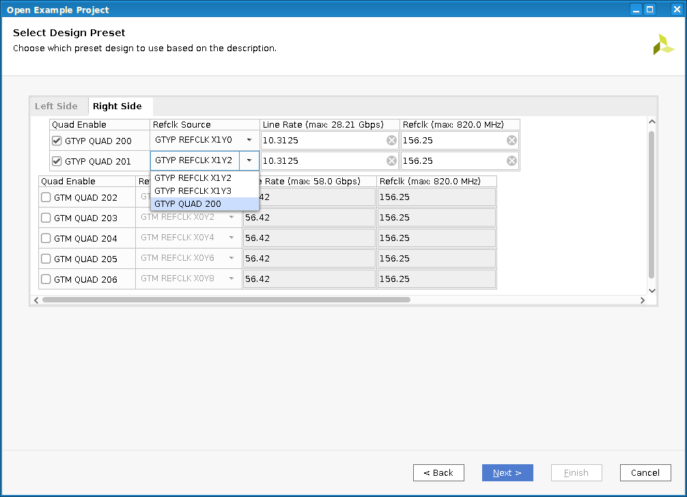

# versal_ibert_ced
A Vivado Configurable Example Design for generating GT-based designs for IBERT testing

This CED will allow the user to generate a design with any combination of Quads in any Versal device.
Each Quad can be set up to operate independently, or share references clocks as allowed.  Further customization
can be done after the design is generated.  Location and timing constraints are included in the design generation.

In Vivado from the opening screen, choose "Open Example Project" and the "Versal IBERT" CED.  After choosing a project
name and a part, you will get to the customization GUI.

The best practice is to go from left to right.  First enable all the quads you want in the design.  Then choose the reference
clock structure.  If the line rate is less than 16.375G, reference clocks can be forwarded up to two quads above and two
quads below the source.  That means up to five quads can share the same reference clock.  If a quad is getting its refclk
from a neighbor, the line rate setting is inherited, and the line rate and refclk rate text fields are disabled.  Then choose
line rates and reference clock rates.  Inputs will be validated according to the speed grade. 

When choosing a local clock, the first XY location choice in the combo box is referring to REFCLK0, and the second REFCLK1. 

Notice there are two tabs- one for the left side of the device, and one for the right.  Once you are done customizing, click
OK, and the design will be generated.  The block design will be opened by default, and further customization can be performed 
at this time.  More specific GT settings like the type of PLL, the internal data width, or other choices can be made by double-clicking
on the appropriate gt_bridge IP and customizing it. 

Once the design is the way you want it, just click on Generate Device Image to create a PDI file.
